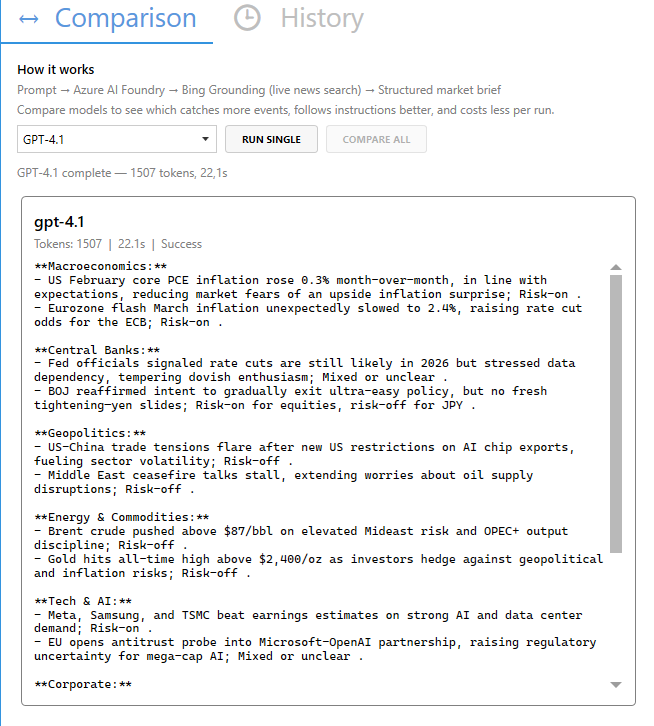
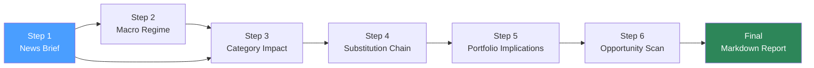

# FikaForecast

A WPF desktop application that runs AI agents to analyze financial markets. Built with **Microsoft Agent Framework** and **Azure AI Foundry** to demonstrate agent orchestration, model comparison, and a multi-step analysis pipeline.



## Pipeline



| Step | Agent | What it does |
| --- | --- | --- |
| 1 | News Brief | Scans 14 days of news via Bing Grounding, produces categorized market brief |
| 2 | Macro Regime | Classifies current regime (stagflation, risk-off, reflationary, etc.) |
| 3 | Category Impact | Maps direction + causal chains for every fund category |
| 4 | Substitution Chain | Follows disruption chains to find rotation beneficiaries |
| 5 | Portfolio Implications | Evaluates current positions against new signals |
| 6 | Opportunity Scan | Flags up to 3 uninvested categories worth watching |

## Model Comparison

All models run through **Azure AI Foundry**. Same agent, same prompt, different brain -- compare side-by-side.

| Model | Role | Status |
| --- | --- | --- |
| gpt-4.1 | Flagship baseline | Deployed |
| gpt-5.4-mini | Next-gen baseline (needs SDK migration to Azure.AI.Projects for Bing Grounding) | TODO |
| gpt-5.4 | Flagship quality benchmark | TODO |
| gpt-5.4-nano | Ultra-budget option | TODO |
| DeepSeek | Open-source heavyweight | TODO |

## Tech Stack

| Layer | Technology |
| --- | --- |
| Desktop UI | WPF, MahApps.Metro, WebView2 |
| MVVM | DevExpress MVVM |
| DI | Autofac |
| Reactive | Rx.NET |
| Persistence | EF Core + SQLite |
| AI Platform | Azure AI Foundry (model catalog + Bing Grounding) |
| Agent Framework | Microsoft Agent Framework |
| Logging | NLog |

## Solution Structure

```text
FikaForecast/
  FikaForecast.sln
  FikaForecast.Wpf/            -- WPF startup project
  FikaForecast.Domain/         -- Core domain (no external dependencies)
  FikaForecast.Application/    -- Use cases and orchestration
  FikaForecast.Infrastructure/ -- AI agents, persistence, external services
```

Architecture follows **Domain-Driven Design** -- dependencies point inward.

## Roadmap

- [ ] **Migrate SDK from `Azure.AI.Agents.Persistent` to `Azure.AI.Projects`** — the classic Agents API doesn't support Bing Grounding with gpt-5.x models. The new Foundry Agent Service API does. This unlocks gpt-5.4-mini/nano/pro + Bing Grounding.
- [ ] Add gpt-5.4-mini, gpt-5.4, gpt-5.4-nano model configs
- [ ] Add DeepSeek model config
- [ ] Implement pipeline steps 2–6

## Documentation

- [News Brief Agent Architecture](docs/news-brief-agent-architecture.md) -- Detailed Step 1 design, Mermaid diagrams, domain model, persistence schema
- [Azure Deployment Guide](../docs/AZURE-DEPLOYMENT.md) -- Resource groups, AI Foundry setup, cost tracking
- [Secrets Management](../docs/SECRETS-MANAGEMENT.md) -- API keys, user secrets, Key Vault
