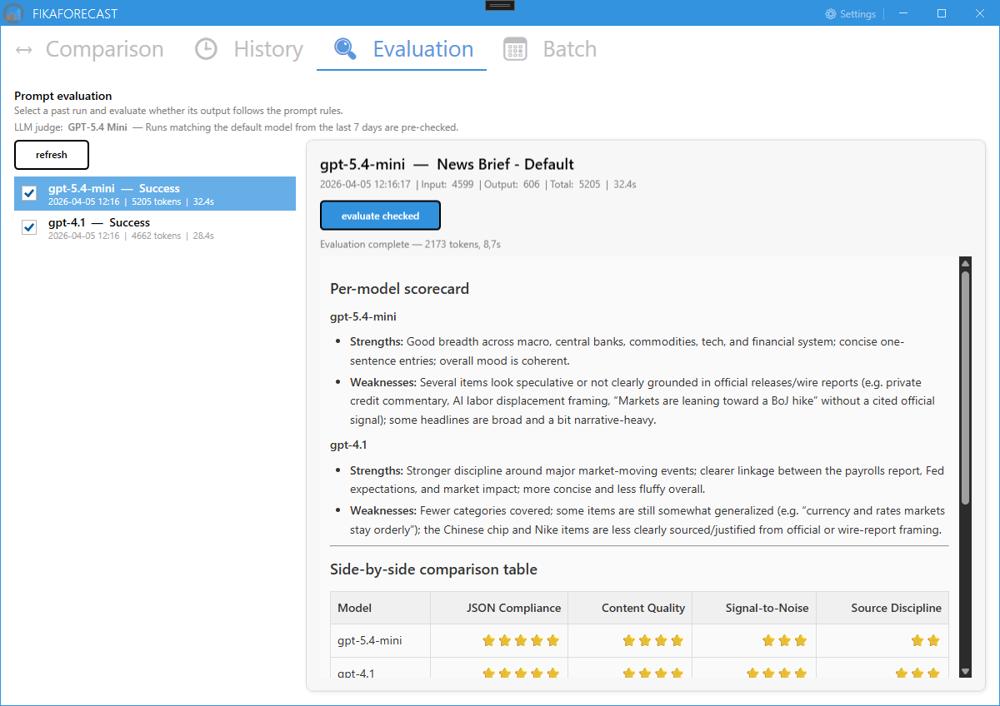
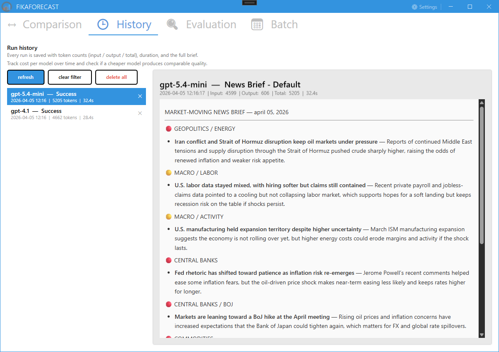
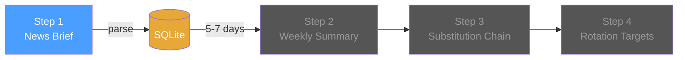

# FikaForecast

WPF desktop application that runs AI agents to analyze financial markets. Compare how different models handle the same analysis task, and let a judge agent evaluate report quality.


## Tech Stack

| Layer | Technology |
| --- | --- |
| AI Platform | Azure AI Foundry (model catalog + Bing Grounding) |
| Agent Framework | Microsoft Agent Framework (Foundry Agent Service v2) |
| Desktop UI | WPF, MahApps.Metro, WebView2 |
| MVVM | DevExpress MVVM |
| DI | Autofac |
| Reactive | Rx.NET |
| Persistence | EF Core 9 + SQLite |
| Logging | NLog |

## Architecture

```text
FikaForecast/
  FikaForecast.sln
  FikaForecast.Wpf/            -- WPF startup, views, view models
  FikaForecast.Domain/         -- Core domain (no external dependencies)
  FikaForecast.Application/    -- Use cases, orchestration, interfaces
  FikaForecast.Infrastructure/ -- AI agents, EF Core, external services
```

**Domain-Driven Design** -- dependencies point inward. Domain has zero external references. Infrastructure implements application interfaces. Autofac wires everything up with per-layer modules.

## Features

### Compare models side-by-side

Run the same News Brief prompt through multiple Azure AI Foundry models in parallel. Each result shows token usage, duration, and the full markdown report rendered via WebView2.

<!--  -->

### Evaluate and rank reports

An evaluation agent checks individual reports against quality rules (formatting, source attribution, category coverage). Select multiple reports and a comparison agent ranks them with a scorecard and picks a winner.

<!--  -->

### Browse run history

All runs are persisted to SQLite. Filter by model, inspect past reports, delete old runs. Full markdown rendering in the detail pane.

<!--  -->

### Configure models and prompts

Enable/disable models, set the default, and edit all three prompts (news brief, evaluation, comparison) directly in the app. Prompts are stored as external files with embedded-resource fallback.

<!--  -->

## Analysis Pipeline

Step 1 is implemented. Steps 2--4 are planned.



Step 1 uses **Agent Service** (needs Bing Grounding for web search). Steps 2--4 use **chat completions** (prompt-in/JSON-out, no tools needed).

| Step | Agent | What it does | Status |
| --- | --- | --- | --- |
| 1 | News Brief | Scans 14 days of news via Bing Grounding, produces categorized market brief | Done |
| 2 | Weekly Summary | Aggregates 5--7 daily briefs (default model) into confidence-weighted weekly summary | Planned |
| 3 | Substitution Chain | Follows disruption chains to find rotation beneficiaries | Planned |
| 4 | Rotation Targets | Flags up to 3 strongest capital rotation destinations worth watching | Planned |

## Models

All models run through **Azure AI Foundry Agent Service**. Same agent, same prompt, different brain.

### Agent Service compatible (Bing Grounding supported)

These models work natively with the Agent Service and support Bing Grounding — no custom code needed.

| Model | Role | $/MTok (in → out) | Status |
| --- | --- | --- | --- |
| gpt-4.1 | Flagship baseline | ~$2 → $8 | Deployed |
| gpt-5.4-mini | Next-gen baseline | $0.75 → $4.50 | Deployed |
| gpt-5.4 | Flagship quality benchmark | $2.50 → $15 | Planned |
| gpt-5.4-nano | Ultra-budget option | $0.20 → $1.25 | Planned |
| DeepSeek-V3.1 | Open-source, tool calling + Bing Grounding | $1.23 → $4.94 | Planned |
| grok-3 | xAI reasoning, Bing Grounding | $3 → $15 | Planned |

> **Bing Grounding is the bottleneck.** Many newer/cheaper models (DeepSeek-V3.2, Grok 4, Grok 3 Mini) are available in AI Foundry but do **not** support Bing Grounding in Agent Service yet. Since the News Brief agent relies on Bing for web search, only models listed above can be used without custom integration. Check the [tool support matrix](https://learn.microsoft.com/azure/foundry/agents/concepts/tool-best-practice#tool-support-by-region-and-model) for updates.

### Requires custom integration (no Bing Grounding in Agent Service)

These models are available in AI Foundry but don't support Bing Grounding through Agent Service. Using them for the news brief agent would require a custom web search integration (e.g., calling Bing Search API directly and injecting results into the prompt).

Claude models have [built-in web search](https://www.anthropic.com/news/web-search-api) via the Messages API — see [Claude models in Foundry](https://learn.microsoft.com/azure/foundry/foundry-models/how-to/use-foundry-models-claude).

| Model | Why it's interesting | $/MTok (in → out) | Blocker |
| --- | --- | --- | --- |
| Claude Sonnet 4.6 | Anthropic frontier, 1M context, built-in web search | $3 → $15 + $10/1K searches | Partner model (Preview), Messages API, needs `Microsoft.Agents.AI.Anthropic` NuGet |
| Claude Haiku 4.5 | Fast + cheap Anthropic option, built-in web search | $1 → $5 + $10/1K searches | Same as above |
| DeepSeek-R1-0528 | Reasoning beast — useful for evaluation/comparison agents | [Pricing](https://azure.microsoft.com/pricing/details/ai-foundry-models/deepseek/) | No tool calling, no Bing Grounding |
| Llama-4-Maverick-17B-128E-Instruct-FP8 | Fast FP8 inference, cost-efficient | [Pricing](https://azure.microsoft.com/pricing/details/ai-foundry-models/) | No Bing Grounding |

**Implementation note:** Multi-provider support uses a routing composite pattern — a `RoutingNewsBriefAgent` delegates to provider-specific implementations (Foundry Agent Service or Anthropic Messages API) based on `ModelConfig.Provider`. Keyed services via Autofac `IIndex<AgentProvider, INewsBriefAgent>` stay in Infrastructure; the Application layer remains provider-agnostic.

## Configuration

| Topic | Guide |
| --- | --- |
| AI Foundry setup, Bing Grounding, model deployments | [Azure Deployment](../docs/AZURE-DEPLOYMENT.md) |
| User secrets, Key Vault, API keys | [Secrets Management](../docs/SECRETS-MANAGEMENT.md) |

## Roadmap

- [ ] Add gpt-5.4, gpt-5.4-nano, DeepSeek-V3.1, grok-3 model configs
- [ ] Implement pipeline steps 2--4
- [ ] Portfolio integration layer — match rotation signals to holdings and buyable funds

### Portfolio Integration (future)

The pipeline (Steps 1--4) produces market intelligence: what's moving, where capital is rotating, and which targets are strongest. A future portfolio layer connects this to actionable fund decisions.

| Component | Description |
| --- | --- |
| Fund category taxonomy | Fixed list of fund categories (e.g. MENA equity, gold miners, US growth, defence). Defined in config, not LLM-generated. |
| Holdings table | User-managed list of currently held funds, each tagged with categories from the taxonomy. |
| Fund matching via RAG | Semantic search over fund descriptions and names to find buyable funds matching rotation targets. Leverages the existing [shared backend RAG pipeline](https://github.com/Muhomorik/SemanticKernel-FundDocsQnA-dotnet-nextjs). |
| Trend analysis | All pipeline runs are timestamped and persisted. Query across multiple weekly runs to detect persistent rotation trends (e.g. "capital has flowed toward defence for 3 consecutive weeks"). |

The pipeline's DB-as-interface pattern means the portfolio layer can join `RotationChains` and `RotationTargets` with holdings data without changing Steps 1--4.

## Documentation

- [News Brief Agent Architecture](docs/news-brief-agent-architecture.md) -- Step 1 design, Mermaid diagrams, domain model, persistence schema
