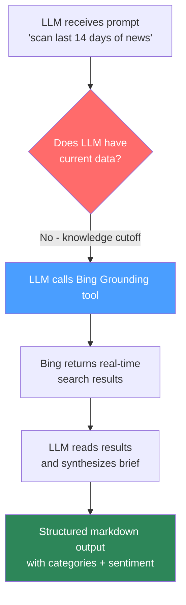
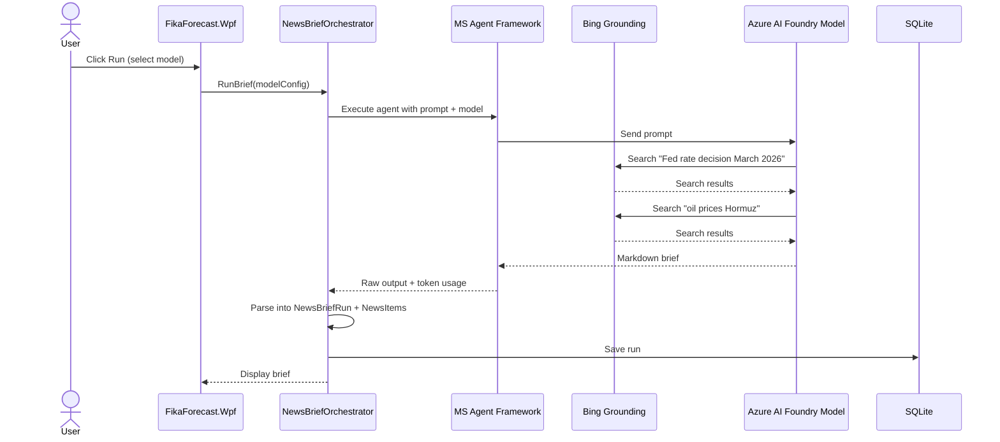
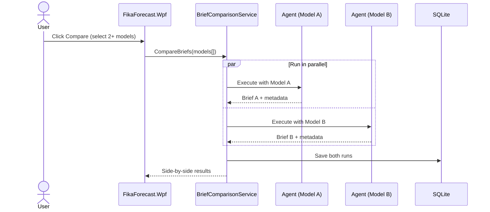
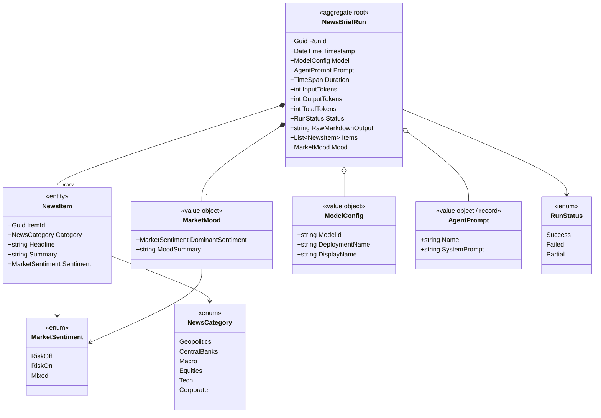
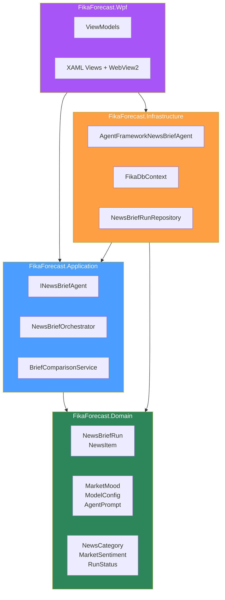
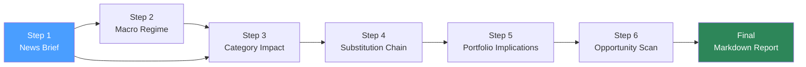

# News Brief Agent -- Architecture

> Step 1 of the FikaForecast analysis pipeline.

**Role:** Market-Moving News Analyst

The News Brief Agent scans the last 14 days of global news and extracts only what matters for financial markets. Its output feeds into all downstream pipeline steps.

For the agent prompt and example output, see [step1-news-brief-agent.md](../../docs/step1-news-brief-agent.md).

## How It Works

LLMs have a knowledge cutoff -- they don't know what happened yesterday. The agent solves this by combining an LLM brain with a real-time search tool:

1. The **Microsoft Agent Framework** gives the LLM access to **Bing Grounding** as a tool
2. The LLM reads the prompt ("scan the last 14 days of news...")
3. It decides on its own to call the Bing search tool, crafting queries like "Fed interest rate decision March 2026", "oil prices Hormuz disruption", etc.
4. Bing returns real-time search results
5. The LLM reads those results and synthesizes them into a structured markdown brief

The LLM is the **brain** (decides what to search, how to interpret, how to format). Bing Grounding is the **eyes** (provides access to current information).

Without the search tool, the agent would either refuse or hallucinate plausible-sounding but completely fake news.

## Why Compare Models?

Not all LLMs think alike. Given the same news and the same prompt, different models will:

- **Catch different events** -- one model might flag a central bank signal that another ignores
- **Weigh impact differently** -- a geopolitical event rated risk-off by one model could be mixed by another
- **Vary in structure and conciseness** -- some models follow formatting instructions better than others
- **Cost wildly different amounts** -- is a flagship model 10x better, or just 10x more expensive?

By running the same agent across multiple models and storing every result, FikaForecast answers: **which model gives the best market intelligence for the money?**

### Default Models

All models are served through the **Azure AI Foundry** model catalog.

| Model | Role | Why |
| --- | --- | --- |
| GPT-5.1-mini | Fast baseline | Cheap, fast, good at structured output |
| GPT-5 | Quality benchmark | Flagship -- is the upgrade worth the cost? |
| Phi-4 | Budget / MS showcase | Microsoft's own model in their own framework |
| DeepSeek | Open-source heavyweight | Different training data, different perspective |

Models are configured in settings, not hardcoded. Add or remove models as the Foundry catalog evolves.

### Agent Prompt

The system prompt (e.g. "You are a sharp financial intelligence analyst...") is a configurable value object (`AgentPrompt` record), not a hardcoded string. This enables:

- Customizing the prompt without code changes
- A/B testing different prompt wordings alongside model comparison
- Step-specific prompt variants as the pipeline evolves

## Data Flow -- Single Run

## Data Flow -- Model Comparison

## Domain Model

Architecture follows **Domain-Driven Design** -- dependencies point inward. The Domain layer has zero external dependencies.

### Entities and Value Objects

## DDD Layer Responsibilities

| Layer | Responsibility |
| --- | --- |
| **Domain** | Entities, value objects, enums. Pure C#, no external dependencies. |
| **Application** | Use cases: `INewsBriefAgent` interface, orchestration, comparison service, DTOs. |
| **Infrastructure** | MS Agent Framework integration, EF Core + SQLite persistence, config loading. |
| **Presentation** | WPF views, ViewModels (DevExpress MVVM), WebView2 markdown rendering. |

## Persistence Schema

SQLite database managed by EF Core. Located in the app's local data folder.

### NewsBriefRuns Table

| Column | Type | Description |
| --- | --- | --- |
| RunId | TEXT (GUID) | Primary key |
| Timestamp | TEXT (ISO 8601) | When the run started |
| ModelId | TEXT | Model identifier (e.g. "gpt-5.1-mini") |
| DeploymentName | TEXT | Azure AI Foundry deployment name |
| PromptName | TEXT | Which prompt was used |
| DurationMs | INTEGER | How long the agent took |
| InputTokens | INTEGER | Prompt / input tokens |
| OutputTokens | INTEGER | Completion / output tokens |
| TotalTokens | INTEGER | Input + output combined |
| Status | TEXT | Success / Failed / Partial |
| RawMarkdownOutput | TEXT | The full markdown brief |

### NewsItems Table

| Column | Type | Description |
| --- | --- | --- |
| ItemId | TEXT (GUID) | Primary key |
| RunId | TEXT (GUID) | FK to NewsBriefRuns |
| Category | TEXT | Geopolitics, CentralBanks, Macro, etc. |
| Headline | TEXT | Bold headline from the brief |
| Summary | TEXT | One-sentence summary |
| Sentiment | TEXT | RiskOff / RiskOn / Mixed |

### MarketMoods Table

| Column | Type | Description |
| --- | --- | --- |
| RunId | TEXT (GUID) | PK + FK to NewsBriefRuns |
| DominantSentiment | TEXT | RiskOff / RiskOn / Mixed |
| MoodSummary | TEXT | The 2-line closing summary |

## Output Schema

The agent returns structured markdown. See [step1-news-brief-agent.md](../../docs/step1-news-brief-agent.md) for the full output schema and example.

| Section | Required | Description |
| --- | --- | --- |
| Title with date | Yes | `MARKET-MOVING NEWS BRIEF -- {date}` |
| Category blocks | Yes | One or more of: Geopolitics/Energy, Central Banks, Macro/Inflation, Equities, Tech/AI, Corporate/Other |
| Impact flag per item | Yes | Risk-off / Risk-on / Mixed |
| Overall mood summary | Yes | 2-line closing summary with dominant sentiment flag |

After generation, the raw markdown is parsed into `NewsBriefRun`, `NewsItem`, and `MarketMood` entities and persisted to SQLite for structured querying and comparison.

## Pipeline Context

This agent is Step 1 of a 6-step pipeline:

Every downstream step depends on the quality and completeness of this brief. That's why model comparison matters here -- the brief is the foundation.
