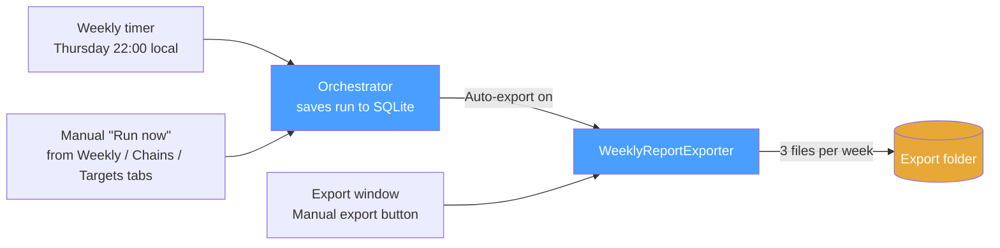

# Weekly Report Export

FikaForecast can hand off each week's analytics as plain markdown files so a separate **fund analytics AI agent** can read them, compare weeks, and reason about the underlying opinions. The exported files live outside the SQLite database — the AI agent only needs a folder path.

## What gets exported

Three report types per ISO week, each produced by one of the numbered pipeline
steps described in the [main README](../README.md#analysis-pipeline):

| Pipeline step | Report | Filename slug | Source entity | Renderer | Orchestrator |
| --- | --- | --- | --- | --- | --- |
| Step 2 | Weekly Summary | `weekly-summary` | [`WeeklySummaryRun`](../FikaForecast.Domain/Entities/WeeklySummaryRun.cs) | [`WeeklySummaryMarkdownRenderer`](../FikaForecast.Application/Services/WeeklySummaryMarkdownRenderer.cs) | [`WeeklySummaryOrchestrator`](../FikaForecast.Application/Services/WeeklySummaryOrchestrator.cs) |
| Step 3 | Substitution Chain | `substitution-chain` | [`SubstitutionChainRun`](../FikaForecast.Domain/Entities/SubstitutionChainRun.cs) | [`SubstitutionChainMarkdownRenderer`](../FikaForecast.Application/Services/SubstitutionChainMarkdownRenderer.cs) | [`SubstitutionChainOrchestrator`](../FikaForecast.Application/Services/SubstitutionChainOrchestrator.cs) |
| Step 4 | Rotation Targets | `rotation-targets` | [`OpportunityScanRun`](../FikaForecast.Domain/Entities/OpportunityScanRun.cs) | [`OpportunityScanMarkdownRenderer`](../FikaForecast.Application/Services/OpportunityScanMarkdownRenderer.cs) | [`OpportunityScanOrchestrator`](../FikaForecast.Application/Services/OpportunityScanOrchestrator.cs) |

Each run entity exposes a `RawMarkdownOutput` property — the emoji-rendered
display markdown written by its renderer. The exporter embeds that string
verbatim inside the report fences; it does **not** re-parse the structured data.

> **Step 1 (News Brief)** is not exported — it's the daily upstream feed consumed
> by Step 2. See the [Step 1 — News Brief agent doc](../../docs/step1-news-brief-agent.md)
> for its design.

Filename pattern:

```text
{YYYY}-W{ww}-{slug}.md
```

Examples for ISO week 15 of 2026:

```text
2026-W15-weekly-summary.md
2026-W15-substitution-chain.md
2026-W15-rotation-targets.md
```

The week label (`YYYY-Www`) is the ISO 8601 week of `WeeklySummaryRun.WeekStart`, matching what the frontend shows in the "Week 15" badge. The same week resolves to the same filename every run, so **re-exporting overwrites silently** — latest successful run wins.

## Triggers



**Auto-export** — each of the three pipeline orchestrators (`WeeklySummaryOrchestrator`, `SubstitutionChainOrchestrator`, `OpportunityScanOrchestrator`) calls the exporter after persisting its run. The call no-ops when **Auto-export** is off or the **Export folder** is blank, so existing installs behave exactly as before until you opt in. Failed runs are skipped and logged.

**Manual export** — the Export window's *Manual export* section lets you pick any past week and writes all three report types at once, regardless of the auto-export toggle. The dropdown lists distinct ISO weeks that have at least one successful weekly summary, newest first.

## Settings

Open the window via the 📤 **Export** button in the main window caption (before ⚙ Settings).

| Setting | Stored in `settings.json` as | Purpose |
| --- | --- | --- |
| Export folder | `ExportFolderPath` | Destination for all markdown files. |
| Auto-export | `AutoExportEnabled` | Master switch for the orchestrator hooks. |

Settings live in the existing `%LocalAppData%\FikaForecast\settings.json` file next to model + sync preferences.

## File format

Each file starts with an H1, a YAML metadata block wrapped in HTML comment fences, then the report body wrapped in its own fences. The pair of `<!-- BEGIN/END METADATA -->` and `<!-- BEGIN/END REPORT -->` comments give the downstream AI agent deterministic split points when multiple files are concatenated into a single chat message.

```markdown
# Substitution Chain — Week 15 (Apr 7 – Apr 13, 2026)

<!-- BEGIN METADATA -->
​```yaml
report_type: substitution-chain
iso_week: 2026-W15
period_start: 2026-04-07
period_end: 2026-04-13
generated_at: 2026-04-16T22:10:00+02:00
model: gpt-5.4-mini
run_id: 3f2cffff-ffff-ffff-ffff-ffffffffffff
​```
<!-- END METADATA -->

<!-- BEGIN REPORT -->

🔴 **Fleeing:** Emerging-markets debt

🟢 **Toward:** US short-duration Treasuries

> **Mechanism:** Rate-cut repricing pushed hot money out of EM carry trades…

---

<!-- END REPORT -->
```

Notes:

- Dates inside the YAML block (`period_start`, `period_end`, `generated_at`) use **invariant culture**. The file is machine-consumed — it must not vary by host locale.
- The `# H1` above the metadata is for humans glancing at the raw file; the parseable shape is the YAML block.
- `report_type` carries the filename slug (`weekly-summary`, `substitution-chain`, `rotation-targets`), stable across weeks.
- The report body is the existing display markdown from the run entity — emoji rendering included. No re-parsing; the exporter wraps, it doesn't transform.

## Components

```text
FikaForecast.Application/
  DTOs/ReportType.cs                    -- WeeklySummary | SubstitutionChain | RotationTargets
  DTOs/ExportReportContext.cs           -- record passed to the formatter
  Services/IsoWeek.cs                   -- matches the frontend's isoWeekNumber
  Services/ReportExportMarkdownFormatter.cs
  Interfaces/IWeeklyReportExporter.cs
  Interfaces/IExportSettingsProvider.cs

FikaForecast.Infrastructure/
  Services/WeeklyReportExporter.cs      -- file I/O + auto-export guards

FikaForecast.Wpf/
  Services/ExportSettingsProvider.cs    -- IExportSettingsProvider impl over IUserSettingsService
  Services/FolderPicker.cs              -- thin wrapper over Microsoft.Win32.OpenFolderDialog
  ViewModels/ExportViewModel.cs
  ViewModels/WeekOption.cs
  Views/ExportWindow.xaml
```

The orchestrators only depend on `IWeeklyReportExporter`; the Infrastructure implementation reads toggle state through `IExportSettingsProvider` so the Application layer stays free of presentation-layer settings types.

## Testing

- `ReportExportMarkdownFormatterTests` — H1, metadata fields, fences, cross-year range.
- `IsoWeekTests` — ISO 8601 boundary cases (year roll-forward, roll-backward, 53-week years).
- `WeeklyReportExporterTests` — auto-export no-ops when disabled, correct filename + header on write, parent-week lookup via repos, overwrite, manual export throws without path, picks latest successful run.
