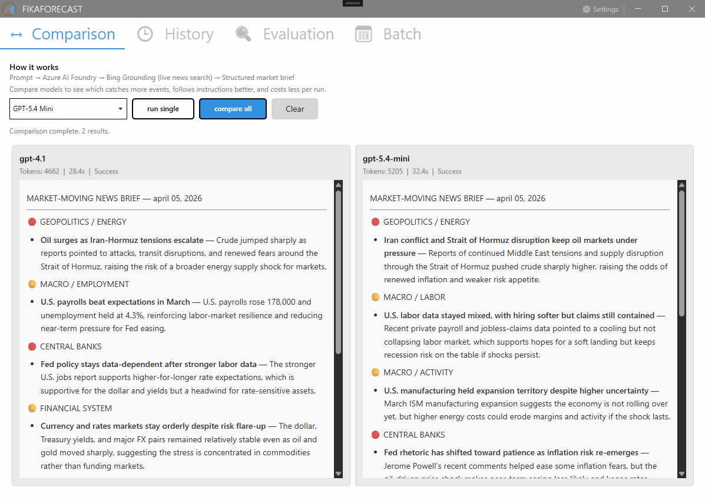

# KanelBulleKapital

🤪 Coffee-fueled, sugar-coated, financially doomed

**Goal:** Build an event-driven multi-agent system that forms, tests, and acts on market hypotheses autonomously — using Microsoft Agent Framework and Azure AI Foundry.

> Continuation of [SemanticKernel-FundDocsQnA-dotnet-nextjs](https://github.com/Muhomorik/SemanticKernel-FundDocsQnA-dotnet-nextjs) — shares the same backend (ASP.NET Core Web API, RAG over fund documents, function calling against Azure SQL).

## Roadmap

Continuous hypothesis evaluation using event-driven multi-agent architecture on Azure AI Foundry.

- [x] **Step 1 — [News Brief & Model Comparison](FikaForecast/README.md)**
  - [x] News Brief agent — 14-day Bing Grounding scan, categorized market brief
  - [x] Multi-model comparison — same prompt through multiple Azure AI Foundry models in parallel
  - [x] Evaluation agent — checks individual reports against quality rules
  - [x] Comparison agent — ranks reports with scorecard, picks a winner
  - [x] Batch scheduler — automated runs at 4-hour intervals, `--auto-schedule` CLI flag
  - [x] Run history — all runs persisted to SQLite, filterable by model
  - [x] Configurable models and prompts
- [ ] **Step 2 — Event-driven trigger**
  - [ ] Fund data → Service Bus queue → EventGrid trigger → Foundry Agent workflow
  - [ ] Agent wakes on data arrival, not on schedule
  - [ ] Ingress Agent loads session state and routes to active hypotheses
  - [ ] Agent pipeline: Ingress → RAG Retrieval → Hypothesis Evaluation → Signal Consolidation → Session State Writer
- [ ] **Step 3 — The RAG problem**
  - [ ] Semantic retrieval over fund descriptions to separate specific exposures from coarse category labels
  - [ ] Peer group assembled from meaning, not from provider-assigned categories
  - [ ] Fund description indexing and embedding
- [ ] **Step 4 — Three-level evaluation**
  - [ ] Broad sector → specific exposure (RAG) → held instrument
  - [ ] Decision matrix: market flush vs thesis weakening vs vehicle problem vs single-instrument failure
  - [ ] Evidence log — each session result appended to hypothesis record
- [ ] **Step 5 — The loop closing**
  - [ ] Hypothesis status transitions (ACTIVE_UNCONFIRMED → CONFIRMED → entry signal)
  - [ ] Automatic re-entry when conditions met — no human prompt
  - [ ] Hypothesis archival with full evidence log on invalidation
- [ ] **Step 6 — Virtual bank simulator**
  - [ ] Paper-trading engine to test agent recommendations with simulated capital
  - [ ] Portfolio state persisted in Azure Table Storage
  - [ ] Automatic weekly evaluation of portfolio performance
- [ ] **Step 7 — Deploy as frontend to Azure**
  - [ ] Web frontend on Azure Static Web Apps

## Projects

This repo is a monorepo — each step in the roadmap lives in its own project folder.

### [FikaForecast](FikaForecast/)

A WPF desktop app that runs AI agents to analyze financial markets. Compares how different LLMs perform on the same market analysis task using Microsoft Agent Framework and Azure AI Foundry.

**Features:** model comparison, batch scheduler (automated daily runs at 4-hour intervals), run history, evaluation agent, configurable prompts and models

**Stack:** .NET 9, WPF, MahApps.Metro, EF Core + SQLite, Azure AI Foundry, Microsoft Agent Framework

## Documentation

- [Azure Deployment Guide](docs/AZURE-DEPLOYMENT.md) -- Resource groups, AI Foundry setup, model deployments, cost tracking
- [Secrets Management](docs/SECRETS-MANAGEMENT.md) -- API keys, user secrets, Key Vault configuration
