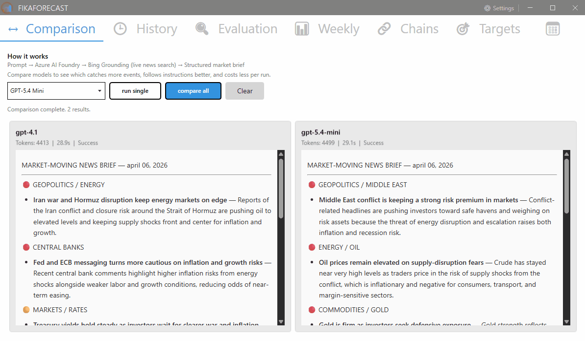

# KanelBulleKapital

🤪 Coffee-fueled, sugar-coated, financially doomed

> **Naming convention — welcome to the KCU (Kanelbulle Cinematic Universe).**
> *Kanel* is Swedish for "cinnamon", and a *kanelbulle* is a cinnamon bun — the classic Swedish fika pastry.
> *Fika* is the Swedish coffee-break ritual — pause work, grab coffee and something sweet, chat with colleagues. It's practically a national institution.
> *Smörgåsbord* (literally "sandwich table") is a buffet-style spread of many small dishes — the dashboard serves up a little of everything the agents produced.
> Everything in this repo leans into that theme: *KanelBulleKapital* (the universe itself — "Cinnamon Bun Capital"),
> *FikaForecast* (the WPF app), *SmorgasBoard* (the dashboard), *KanelBrief* (the backend).
> If you spot a pastry-themed name, that's on purpose.

**[Live Demo — SmorgasBoard Dashboard](https://lemon-bush-08a967d03.4.azurestaticapps.net/)**

**Goal:** Build an event-driven multi-agent system that forms, tests, and acts on market hypotheses autonomously — using Microsoft Agent Framework and Azure AI Foundry.

> Continuation of [SemanticKernel-FundDocsQnA-dotnet-nextjs](https://github.com/Muhomorik/SemanticKernel-FundDocsQnA-dotnet-nextjs) — shares the same backend (ASP.NET Core Web API, RAG over fund documents, function calling against Azure SQL).

### [FikaForecast](FikaForecast/)

A WPF desktop app that runs AI agents to analyze financial markets. Compares how different LLMs perform on the same market analysis task using Microsoft Agent Framework and Azure AI Foundry.

### SmorgasBoard Dashboard

A web dashboard for browsing daily and weekly market briefs produced by the [KanelBrief backend](backend/README.md).
Built with a [Next.js frontend](frontend/README.md) on Azure Static Web Apps, backed by Azure Functions running four AI agents on schedule.

## Roadmap

Continuous hypothesis evaluation using event-driven multi-agent architecture on Azure AI Foundry.

- [x] **Step 1 — [News Brief & Model Comparison](FikaForecast/README.md)**
  - [x] News Brief agent — 14-day Bing Grounding scan, categorized market brief
  - [x] Multi-model comparison — same prompt through multiple Azure AI Foundry models in parallel
  - [x] Evaluation agent — checks individual reports against quality rules
  - [x] Comparison agent — ranks reports with scorecard, picks a winner
  - [x] Batch scheduler — automated runs at 4-hour intervals, `--auto-schedule` CLI flag
  - [x] Run history — all runs persisted to SQLite, filterable by model
  - [x] Configurable models and prompts
- [x] **Step 2 — Timer-driven agent pipelines**
  - [x] Azure Functions host with `TimerTrigger` bindings — no Service Bus, no EventGrid, just cron
  - [x] `DailyPipelineOrchestrator` routes timer events to pipeline services, zero business logic in the trigger
  - [x] Daily News Brief pipeline — fires at `0 8 * * *` UTC
  - [x] Weekly Aggregation pipeline — fires at `0 9 * * 1` UTC (Monday mornings)
  - [x] `IsPastDue` detection logs a warning when a run is behind schedule
- [ ] **Step 3 — The RAG problem**
  - [ ] Semantic retrieval over fund descriptions to separate specific exposures from coarse category labels
  - [ ] Peer group assembled from meaning, not from provider-assigned categories
  - [ ] Fund description indexing and embedding
- [ ] **Step 4 — Three-level evaluation**
  - [ ] Broad sector → specific exposure (RAG) → held instrument
  - [ ] Decision matrix: market flush vs thesis weakening vs vehicle problem vs single-instrument failure
  - [ ] Evidence log — each session result appended to hypothesis record
- [ ] **Step 5 — The loop closing**
  - [ ] Hypothesis status transitions (ACTIVE_UNCONFIRMED → CONFIRMED → entry signal)
  - [ ] Automatic re-entry when conditions met — no human prompt
  - [ ] Hypothesis archival with full evidence log on invalidation
- [ ] **Step 6 — Virtual bank simulator**
  - [ ] Paper-trading engine to test agent recommendations with simulated capital
  - [ ] Portfolio state persisted in Azure Table Storage
  - [ ] Automatic weekly evaluation of portfolio performance
- [x] **Step 7 — [SmorgasBoard Dashboard](https://lemon-bush-08a967d03.4.azurestaticapps.net/)**
  - [x] KanelBrief backend — Azure Functions (Flex Consumption) with 4 AI agents
  - [x] Daily timer (8 UTC) → News Brief agent, Weekly timer (Monday 9 UTC) → Summary → Substitution Chain → Opportunity Scan
  - [x] Azure Tables persistence, Managed Identity auth, CI/CD via GitHub Actions
  - [x] Next.js frontend on Azure Static Web Apps (free tier)
  - [x] Date picker for browsing historical runs

**Features:** model comparison, batch scheduler (automated daily runs at 4-hour intervals), run history, evaluation agent, configurable prompts and models

**Stack:** .NET 9, WPF, MahApps.Metro, EF Core + SQLite, Azure AI Foundry, Microsoft Agent Framework

## Documentation

- [Azure Deployment Guide](docs/AZURE-DEPLOYMENT.md) -- Resource groups, AI Foundry setup, model deployments, cost tracking
- [Secrets Management](docs/SECRETS-MANAGEMENT.md) -- API keys, user secrets, Key Vault configuration
