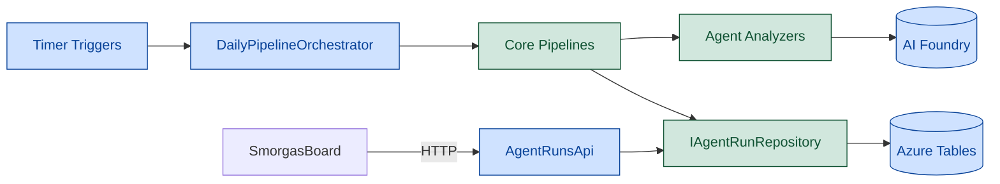
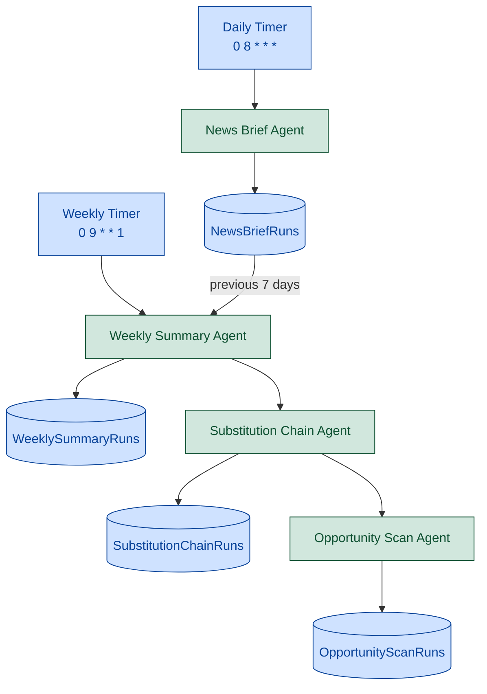
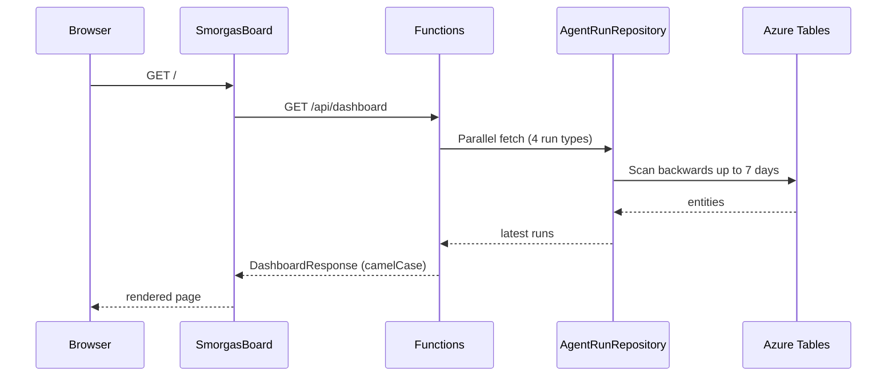

# Backend — KanelBrief

> .NET 9 Azure Functions app. Runs AI agents on a schedule,
> analyzes market news via **Microsoft Agent Framework** + **Azure AI Foundry**,
> and persists structured results to Azure Tables for the SmorgasBoard frontend to consume.

Part of the KanelBulle Universe — cloud engine for the SmorgasBoard dashboard.

## 🛠️ Tech Stack

| Technology | Version | Purpose |
|------------|---------|---------|
| .NET | 9.0 | Framework |
| Azure Functions | v4 isolated worker | Serverless compute |
| Microsoft Agent Framework | preview | Agent orchestration (`Azure.AI.Agents.Persistent`) |
| Azure AI Foundry | — | Model hosting (gpt-5.4-mini) |
| Azure Tables | — | Run persistence |
| `Azure.Identity` | latest | `DefaultAzureCredential` auth |
| NUnit + AutoFixture + AutoMoq | latest | Unit tests |

## 📋 Overview

Four agents run on timer triggers and populate a daily/weekly market intelligence pipeline:

- **News Brief** — daily market mood + category-level sentiment assessments (Bing Grounding optional).
- **Weekly Summary** — aggregates the week's briefs into confidence-weighted themes.
- **Substitution Chain** — identifies capital rotation paths from weekly themes.
- **Opportunity Scan** — scores top rotation targets with signal strength + risk caveats.

All agent outputs are plain POCOs — the Core project has **zero Azure dependencies** and is fully unit-testable without mocking the SDK.

## 🏗️ Architecture

### High-level



### Weekly pipeline chaining



### Dashboard request flow



## 📁 Project Structure

```text
backend/
├── KanelBrief.sln
│
├── KanelBrief.Core/                     # Zero Azure dependencies — unit testable
│   ├── Agents/                          # Analyzer interfaces (INewsBriefAnalyzer, ...)
│   ├── Models/                          # POCOs: runs, requests, enums, DashboardResponse
│   ├── Parsers/                         # AgentResponseParser (LLM JSON → structured)
│   ├── Pipelines/                       # NewsBriefPipeline, WeeklyAggregationPipeline
│   └── Repositories/                    # IAgentRunRepository interface
│
├── KanelBrief.Functions/                # Azure shell — references Core
│   ├── Agents/                          # Agent Framework implementations (4 analyzers)
│   ├── Api/                             # AgentRunsApi (read endpoints)
│   ├── Orchestration/                   # DailyPipelineOrchestrator (timer host)
│   ├── Repositories/                    # AgentRunRepository (Azure Tables impl)
│   ├── Program.cs                       # DI + Foundry client registration
│   └── host.json / local.settings.json
│
├── KanelBrief.Core.Tests/               # NUnit + AutoFixture + AutoMoq
└── KanelBrief.Functions.Tests/          # Integration-style tests
```

### Why two projects (not full DDD)

KanelBrief is a pipeline executor, not a rich domain, so full 4-layer DDD is overkill. The 2-project split still keeps the real logic testable **without Azure SDK dependencies** — pipelines, parsers, and models live in Core; the Functions project is thin plumbing ("timer fires → call pipeline → write to table").

## 🚀 Quick Start

Foundry is optional locally — agents fall back to placeholder data on failure.

### Visual Studio 2022 Community (preferred)

1. Open `backend/KanelBrief.sln`.
2. Right-click `KanelBrief.Functions` → **Set as Startup Project**.
3. Press **Ctrl+F5** (Start Without Debugging). A console opens listing routes on
   `http://localhost:7220` (port set in `Properties/launchSettings.json`).

**Azurite auto-starts.** VS detects `AzureWebJobsStorage=UseDevelopmentStorage=true`
in `local.settings.json` and launches Azurite silently in the background. No
manual step, no separate install — it ships with VS 2022 Community (Azure
development workload). You never see an Azurite window, and that's fine.

### CLI (for CI or scripts)

Requires **Azure Functions Core Tools v4** and **Azurite** installed separately.

```bash
cd backend
dotnet build
dotnet test
cd KanelBrief.Functions
func start                    # http://localhost:7071 (CLI default)
```

## ⚙️ Configuration

Configuration comes from `local.settings.json` locally and App Settings in Azure.

| Setting | Required | Purpose |
|---------|----------|---------|
| `AzureWebJobsStorage` | ✅ | Functions runtime + Azure Tables connection |
| `TableStorageUri` | ✅ (Azure) | Table endpoint for Managed Identity auth |
| `FOUNDRY_PROJECT_ENDPOINT` | ✅ | AI Foundry project endpoint |
| `BING_CONNECTION_NAME` | optional | Enables Bing Grounding for real-time news search |
| `FUNCTIONS_WORKER_RUNTIME` | ✅ | Must be `dotnet-isolated` |

Local dev uses `dotnet user-secrets` — see [../docs/SECRETS-MANAGEMENT.md](../docs/SECRETS-MANAGEMENT.md).

### Timer schedules

Schedules are compile-time constants on `DailyPipelineOrchestrator`. Changing them requires a code change and redeploy (and updating `frontend/components/footer.tsx` which mirrors them for display).

| Pipeline | CRON | Fires |
|----------|------|-------|
| `DailyNewsBriefTimer` | `0 8 * * *` | Every day at 08:00 UTC |
| `WeeklyAggregationTimer` | `0 9 * * 1` | Every Monday at 09:00 UTC |

The weekly timer chains Weekly Summary → Substitution Chain → Opportunity Scan sequentially, passing context between steps. It skips gracefully if no daily briefs exist for the prior week.

## 🔌 API Endpoints

All endpoints are `AuthorizationLevel.Anonymous` (read-only, public). JSON responses use camelCase.

| Method | Route | Description |
|--------|-------|-------------|
| GET | `/api/dashboard` | Composite: latest run of every type in one call |
| GET | `/api/dashboard?date=yyyy-MM-dd` | Same, for a specific date |
| GET | `/api/runs/news-briefs` | List News Brief runs (latest if no `?date`) |
| GET | `/api/runs/news-briefs/{runDate}/{runId}` | Single News Brief run |
| GET | `/api/runs/weekly-summaries` | List Weekly Summary runs |
| GET | `/api/runs/weekly-summaries/{runDate}/{runId}` | Single Weekly Summary run |
| GET | `/api/runs/substitution-chains` | List Substitution Chain runs |
| GET | `/api/runs/substitution-chains/{runDate}/{runId}` | Single Substitution Chain run |
| GET | `/api/runs/opportunity-scans` | List Opportunity Scan runs |
| GET | `/api/runs/opportunity-scans/{runDate}/{runId}` | Single Opportunity Scan run |

List endpoints without `?date` scan backwards up to 7 days and return the latest available data — the frontend's default "show me something useful" path. Detail endpoints return **404** if the run is missing.

## 💾 Storage Design

Azure Tables, partitioned by date. Nested types (`CategoryAssessment[]`, `RotationChain[]`, `RotationTarget[]`) are serialized to JSON strings in dedicated columns to keep the schema flat.

| Table | PartitionKey | RowKey | Key payload columns |
|-------|--------------|--------|---------------------|
| `NewsBriefRuns` | `RunDate` (`yyyy-MM-dd`) | `RunId` | `Mood`, `Summary`, `AssessmentsJson` |
| `WeeklySummaryRuns` | `RunDate` | `RunId` | `NetMood`, `MoodSummary`, `ThemesJson` |
| `SubstitutionChainRuns` | `RunDate` | `RunId` | `ChainsJson`, `WeeklySummaryRunId` |
| `OpportunityScanRuns` | `RunDate` | `RunId` | `TargetsJson`, `SubstitutionChainRunId` |

All runs share `AgentRunBase` fields: `RunId`, `RunDate`, `CreatedAt` (`DateTimeOffset`), `ModelId`, `Status`, `DurationSeconds`, token counters.

**Enums:**

- `MarketSentiment`: `RiskOn` / `RiskOff` / `Mixed`
- `ConfidenceLevel`: `High` / `Medium` / `Low`
- `SignalStrength`: `Strong` / `Moderate` / `Weak`

## 🧪 Testing

NUnit + AutoFixture + AutoMoq — see the `dotnet-unit-testing-nunit` skill for patterns.

```bash
dotnet test backend/
```

- **Core.Tests** — pipelines, parsers, model serialization, cron schedule verification (Cronos)
- **Functions.Tests** — agents with mocked Foundry clients, repository mapping, API response shapes

## ☁️ Deployment

Hosted on **Azure Functions (Flex Consumption)** for the 30-minute default timeout — agent calls with Bing Grounding can approach the 10-minute limit of classic Consumption. Effectively $0/month at this workload.

| Resource | Tier | Cost |
|----------|------|------|
| Azure Functions | Flex Consumption | ~$0 (within free grant) |
| Azure Storage (Tables + runtime) | Standard LRS | ~$0.05/mo |
| AI Foundry (tokens) | Pay-per-use | ~$1–3/mo light |
| Bing Grounding | Per transaction | ~$1.40–2.80/mo |

Managed Identity + RBAC for Azure Tables — **no connection strings** for table data in production. See [../docs/AZURE-DEPLOYMENT.md](../docs/AZURE-DEPLOYMENT.md).

## 🎯 Key Design Decisions

1. **Azure-free Core** — domain models, pipelines, and parsers have zero Azure references. Unit tests don't mock the SDK.
2. **Repository abstraction** — `IAgentRunRepository` shields agents from storage. Easy to swap Tables for Cosmos/SQL/in-memory.
3. **Fallback on failure** — each agent has a placeholder fallback if the LLM call fails. The pipeline never crashes.
4. **Composite dashboard endpoint** — `/api/dashboard` eliminates the 4-round-trip null-coalescing dance the frontend would otherwise need.
5. **Timer constants, not config** — cron schedules are compile-time constants on the orchestrator so they're statically analyzable and match what the frontend footer displays.
6. **`DateTimeOffset` everywhere** — preserves timezone info across regions. `RunDate` stays a `yyyy-MM-dd` string for PartitionKey compatibility.

## 🐛 Troubleshooting

<details>
<summary><b>Agent calls fail with 401 / DefaultAzureCredential errors</b></summary>

Sign in with Azure CLI (`az login`) so `DefaultAzureCredential` can pick up your token locally. In Azure, make sure the Function App's Managed Identity has **Azure AI Developer** role on the Foundry project.
</details>

<details>
<summary><b>News Brief returns placeholder data instead of real analysis</b></summary>

Check that `FOUNDRY_PROJECT_ENDPOINT` is set and that the gpt-5.4-mini deployment exists. The agent silently falls back to placeholder data on any LLM error — check the Function logs for the actual exception. `BING_CONNECTION_NAME` is optional; without it the agent runs without web grounding.
</details>

<details>
<summary><b>Timer triggers don't fire locally</b></summary>

Azurite must be running (`AzureWebJobsStorage = UseDevelopmentStorage=true`). Timer state is persisted to the storage account — a missing emulator silently disables timer triggers.
</details>

<details>
<summary><b>CORS errors from the frontend</b></summary>

Local dev: add `http://localhost:3000` to `Host.CORS` in `local.settings.json`. Azure: configure CORS on the Function App and include the SWA domain.
</details>

## 📚 Related Docs

- [../README.md](../README.md) — project overview
- [../docs/AZURE-DEPLOYMENT.md](../docs/AZURE-DEPLOYMENT.md) — Foundry setup, cost tracking
- [../docs/SECRETS-MANAGEMENT.md](../docs/SECRETS-MANAGEMENT.md) — user secrets, Key Vault
- [Microsoft Agent Framework](https://learn.microsoft.com/en-us/azure/ai-foundry/concepts/agents)
- [Azure AI Foundry](https://learn.microsoft.com/en-us/azure/ai-foundry/)
