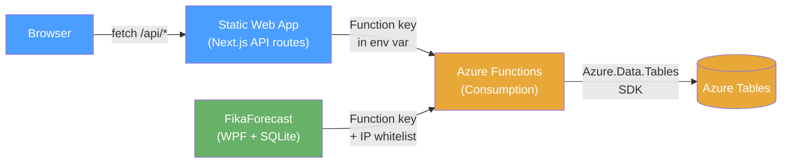
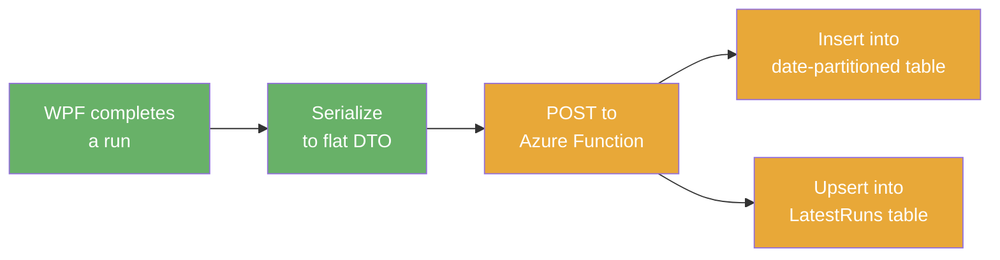
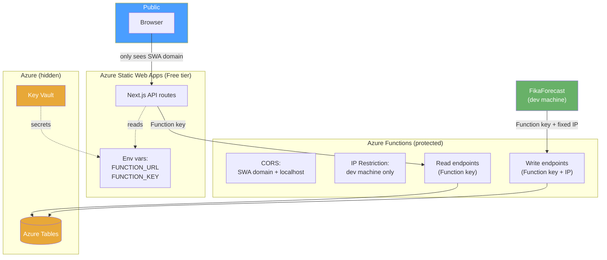
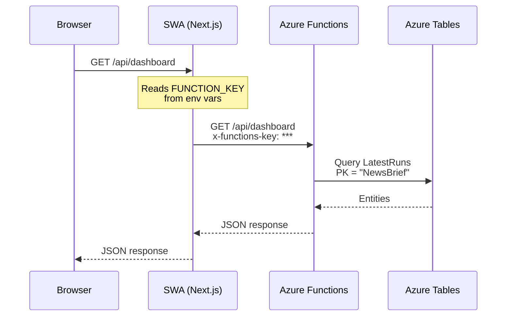

# Frontend Architecture

Public Next.js dashboard showing FikaForecast pipeline results. Data flows from the WPF desktop app through Azure Functions into Azure Tables, then out to the frontend.

## System Overview



- **FikaForecast (WPF)** remains the source of truth with EF Core + SQLite
- **Azure Functions** is the only layer touching Azure Tables (`Azure.Data.Tables` SDK)
- **Next.js** talks to Azure Functions only — never to storage directly
- **Browser** never sees the Function App URL, keys, or storage account names

## Storage Design

### Why Azure Tables

- Very cheap (~$0.05/month for this workload)
- Simple key-value model fits the read-heavy, write-light pattern
- No EF Core provider exists for Azure Tables — use `Azure.Data.Tables` SDK directly

### Table Layout

Structured data only. No raw markdown or raw agent JSON — the frontend shows parsed/structured fields.

#### `NewsBriefRuns`

| Property | Type | Source |
|---|---|---|
| PartitionKey | string | Date: `"2026-04-05"` |
| RowKey | string | RunId (guid) |
| ModelId | string | `NewsBriefRuns.ModelId` |
| DeploymentName | string | `NewsBriefRuns.DeploymentName` |
| DurationSeconds | double | `Duration` as seconds |
| InputTokens | int | |
| OutputTokens | int | |
| TotalTokens | int | |
| Status | string | `"Success"` / `"Failed"` / `"Partial"` |
| Mood | string | `NewsItems.Mood` (flattened — 1:1 relationship) |
| Summary | string | `NewsItems.Summary` (flattened) |
| AssessmentsJson | string | Serialized `CategoryAssessments[]` |

Each assessment in the JSON array:

```json
{
  "category": "Energy",
  "headline": "Oil prices surge...",
  "summary": "OPEC+ cuts...",
  "sentiment": "RiskOff"
}
```

#### `WeeklySummaryRuns`

| Property | Type | Source |
|---|---|---|
| PartitionKey | string | Date: `"2026-04-05"` (Timestamp date) |
| RowKey | string | RunId (guid) |
| WeekStart | DateTimeOffset | |
| WeekEnd | DateTimeOffset | |
| ModelId | string | |
| Status | string | |
| DurationSeconds | double | |
| InputTokens | int | |
| OutputTokens | int | |
| TotalTokens | int | |
| NetMood | string | `"RiskOff"` / `"RiskOn"` / `"Mixed"` |
| MoodSummary | string | |
| ThemesJson | string | Serialized `WeeklySummaryThemes[]` |

Each theme in the JSON array:

```json
{
  "category": "Defence",
  "summary": "Sustained capital inflow...",
  "confidence": "High",
  "sentiment": "RiskOn"
}
```

#### `LatestRuns` (dashboard accelerator)

| PartitionKey | RowKey | Properties |
|---|---|---|
| `NewsBrief` | ModelId | Same fields as `NewsBriefRuns` — overwritten on each run |
| `WeeklySummary` | ModelId | Same fields as `WeeklySummaryRuns` — overwritten on each run |

One partition scan on `LatestRuns` with PK=`NewsBrief` gives latest run per model instantly. No date math, no scanning.

### Partition Key Strategy

Partitioned by **date**. Optimized for timeline/history browsing.

- History browse: query `NewsBriefRuns` partitions in reverse date order
- Use `$select` to skip heavy columns (`AssessmentsJson`, `ThemesJson`) when listing — fetch only on drill-in
- Dashboard: single partition scan on `LatestRuns`

## Azure Functions API

### Write endpoints (called by WPF)

| Endpoint | Purpose |
|---|---|
| `POST /api/news-brief-runs` | Push a completed news brief run + assessments |
| `POST /api/weekly-summary-runs` | Push a completed weekly summary run + themes |

Each write does two table operations:
1. Insert into the date-partitioned table
2. Upsert into `LatestRuns` (overwrite by model)

### Read endpoints (called by Next.js)

| Endpoint | Purpose |
|---|---|
| `GET /api/dashboard` | Latest run per model (reads `LatestRuns` table) |
| `GET /api/news-brief-runs?date=2026-04-05` | List runs by date (lightweight — no assessments) |
| `GET /api/news-brief-runs/{runId}` | Single run detail (includes assessments JSON) |
| `GET /api/weekly-summary-runs?date=2026-04-05` | List weekly summaries by date |
| `GET /api/weekly-summary-runs/{runId}` | Single weekly summary detail (includes themes) |

## Push Pipeline



- **Automatic**: every successful run is pushed immediately
- **Manual retry**: a button in the WPF app to re-push if something fails

The WPF app already has parsed domain objects after each run — it serializes them into flat DTOs and POSTs to the write endpoints.

## Security



### CORS

Azure Functions built-in CORS:
- `https://<your-swa>.azurestaticapps.net`
- `http://localhost:3000` (dev only)

### IP Restrictions

Azure Functions networking → Access Restrictions:
- **Write endpoints**: dev machine fixed IP only
- **Read endpoints**: open (protected by Function keys)

### Function Keys

| Endpoint type | Protection |
|---|---|
| **Write** (WPF push) | Function key + IP restriction |
| **Read** (Next.js) | Function key stored in SWA environment variables |

### What stays hidden

All of this lives in Azure Functions app settings / Key Vault — never exposed to the browser:
- Azure Tables connection string
- Table names and storage account name
- Function keys (Next.js API routes use them server-side)

## Frontend Architecture

### Next.js on Azure Static Web Apps (Free tier)

Next.js API routes act as a thin proxy to Azure Functions:



The browser only sees the SWA domain. Function App URL and keys stay server-side.

### Frontend scope

- **Dashboard**: latest run per model, overall mood, key themes
- **History browse**: scroll through past runs by date, drill into details

## Cost Estimate

| Service | Tier | Monthly cost |
|---|---|---|
| Azure Functions | Consumption (free tier) | ~$0 |
| Azure Storage (Tables) | Standard LRS | ~$0.05 |
| Azure Static Web Apps | Free | $0 |
| Key Vault | Standard (existing) | ~$0 |
| **Total** | | **~$0.05–0.10** |
