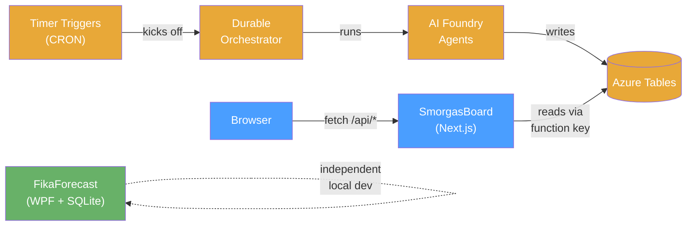
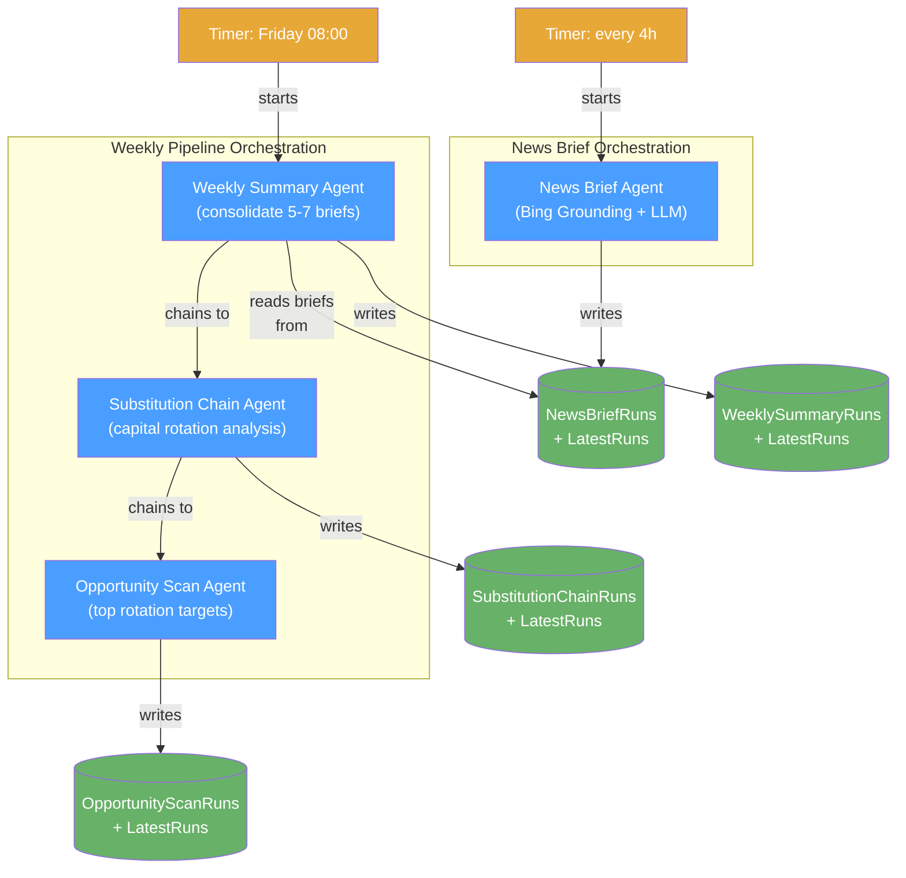
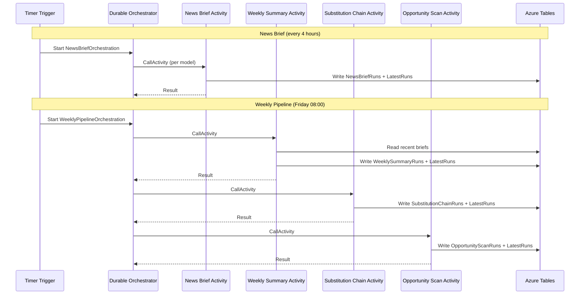
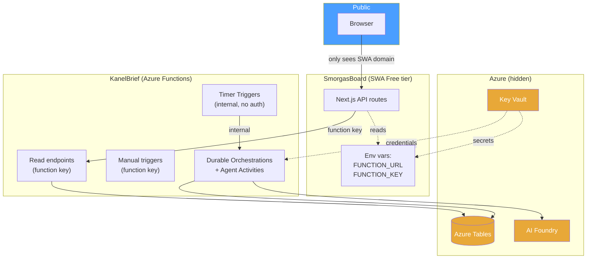
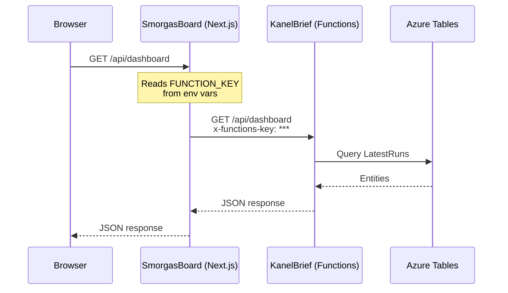

# KanelBulle Cinematic Universe (KCU) — Architecture

Cloud-native AI analysis pipeline. KanelBrief runs agents on schedule, stores results in Azure Tables, SmorgasBoard displays them.

## The KCU (KanelBulle Cinematic Universe)

| Project | Role | Tech |
| --- | --- | --- |
| **FikaForecast** | Desktop app — local dev/testing, prompt iteration | WPF + .NET 9 |
| **KanelBrief** | Cloud engine — runs AI agents on schedule, stores results | Azure Functions (Durable) + .NET |
| **SmorgasBoard** | Web dashboard — public view of pipeline results | Next.js (Azure Static Web Apps) |

FikaForecast and KanelBrief are **separate solutions** with no shared project references. KanelBrief has its own reduced DTOs. They do not sync — each operates independently.

## System Overview


```mermaid
flowchart LR
    Timer["Timer Triggers\n(CRON)"]
    Orch["Durable\nOrchestrator"]
    Agents["AI Foundry\nAgents"]
    Tables[("Azure Tables")]
    SWA["SmorgasBoard\n(Next.js)"]
    Browser["Browser"]
    WPF["FikaForecast\n(WPF + SQLite)"]

    Timer -->|kicks off| Orch
    Orch -->|runs| Agents
    Agents -->|writes| Tables
    SWA -->|reads via\nfunction key| Tables
    Browser -->|fetch /api/*| SWA

    WPF -.->|independent\nlocal dev| WPF

    style Timer fill:#e8a838,color:#fff
    style Orch fill:#e8a838,color:#fff
    style Agents fill:#e8a838,color:#fff
    style Tables fill:#e8a838,color:#fff
    style SWA fill:#4a9eff,color:#fff
    style Browser fill:#4a9eff,color:#fff
    style WPF fill:#68b168,color:#fff
```

- **KanelBrief** (Azure Functions) is the only layer touching Azure Tables and AI Foundry
- **SmorgasBoard** (Next.js) talks to KanelBrief read endpoints only — never to storage directly
- **Browser** never sees the Function App URL, keys, or storage account names
- **FikaForecast** is fully independent — local agents, local SQLite, no cloud dependency

## Agent Pipeline

Four agents run as Durable Functions activities, chained by orchestrators.


```mermaid
flowchart TD
    T1["Timer: every 4h"]
    T2["Timer: Friday 08:00"]

    subgraph "News Brief Orchestration"
        NB["News Brief Agent\n(Bing Grounding + LLM)"]
    end

    subgraph "Weekly Pipeline Orchestration"
        WS["Weekly Summary Agent\n(consolidate 5-7 briefs)"]
        SC["Substitution Chain Agent\n(capital rotation analysis)"]
        OS["Opportunity Scan Agent\n(top rotation targets)"]
    end

    T1 -->|starts| NB
    T2 -->|starts| WS
    WS -->|chains to| SC
    SC -->|chains to| OS

    NB -->|writes| NBT[("NewsBriefRuns\n+ LatestRuns")]
    WS -->|reads briefs\nfrom| NBT
    WS -->|writes| WST[("WeeklySummaryRuns\n+ LatestRuns")]
    SC -->|writes| SCT[("SubstitutionChainRuns\n+ LatestRuns")]
    OS -->|writes| OST[("OpportunityScanRuns\n+ LatestRuns")]

    style T1 fill:#e8a838,color:#fff
    style T2 fill:#e8a838,color:#fff
    style NB fill:#4a9eff,color:#fff
    style WS fill:#4a9eff,color:#fff
    style SC fill:#4a9eff,color:#fff
    style OS fill:#4a9eff,color:#fff
    style NBT fill:#68b168,color:#fff
    style WST fill:#68b168,color:#fff
    style SCT fill:#68b168,color:#fff
    style OST fill:#68b168,color:#fff
```

| Step | Agent | Input | Trigger | Output |
| --- | --- | --- | --- | --- |
| 1 | News Brief | Current date (Bing web search) | Timer: every 4 hours | Mood + categorized assessments |
| 2 | Weekly Summary | 5-7 daily briefs from Tables | Timer: Friday 08:00 | Confidence-weighted themes |
| 3 | Substitution Chain | Weekly themes | Chained after step 2 | Capital rotation chains |
| 4 | Opportunity Scan | Rotation chains | Chained after step 3 | Top 3 rotation targets |

## Storage Design

### Why Azure Tables

- Very cheap (~$0.05/month for this workload)
- Simple key-value model fits the read-heavy, write-light pattern
- Native Azure Functions bindings via `Azure.Data.Tables` SDK

### Table Layout

Structured data only. No raw markdown or raw agent JSON — SmorgasBoard shows parsed/structured fields.

#### `NewsBriefRuns`

| Property | Type | Source |
| --- | --- | --- |
| PartitionKey | string | Date: `"2026-04-05"` |
| RowKey | string | RunId (guid) |
| ModelId | string | AI Foundry deployment |
| DeploymentName | string | Model deployment name |
| DurationSeconds | double | Agent execution time |
| InputTokens | int | |
| OutputTokens | int | |
| TotalTokens | int | |
| Status | string | `"Success"` / `"Failed"` / `"Partial"` |
| Mood | string | Overall market mood |
| Summary | string | Brief summary text |
| AssessmentsJson | string | Serialized `CategoryAssessment[]` |

Each assessment in the JSON array:

```json
{
  "category": "Energy",
  "headline": "Oil prices surge...",
  "summary": "OPEC+ cuts...",
  "sentiment": "RiskOff"
}
```

#### `WeeklySummaryRuns`

| Property | Type | Source |
| --- | --- | --- |
| PartitionKey | string | Date: `"2026-04-05"` |
| RowKey | string | RunId (guid) |
| WeekStart | DateTimeOffset | |
| WeekEnd | DateTimeOffset | |
| ModelId | string | |
| Status | string | |
| DurationSeconds | double | |
| InputTokens | int | |
| OutputTokens | int | |
| TotalTokens | int | |
| NetMood | string | `"RiskOff"` / `"RiskOn"` / `"Mixed"` |
| MoodSummary | string | |
| ThemesJson | string | Serialized `WeeklySummaryTheme[]` |

Each theme in the JSON array:

```json
{
  "category": "Defence",
  "summary": "Sustained capital inflow...",
  "confidence": "High",
  "sentiment": "RiskOn"
}
```

#### `SubstitutionChainRuns`

| Property | Type | Source |
| --- | --- | --- |
| PartitionKey | string | Date: `"2026-04-05"` |
| RowKey | string | RunId (guid) |
| WeeklySummaryRunId | string | Links to triggering weekly summary |
| ModelId | string | |
| Status | string | |
| DurationSeconds | double | |
| InputTokens | int | |
| OutputTokens | int | |
| TotalTokens | int | |
| ChainsJson | string | Serialized `RotationChain[]` |

Each chain in the JSON array:

```json
{
  "capitalFleeing": "Traditional Energy",
  "flowsToward": "Clean Energy ETFs",
  "mechanism": "ESG mandate rotation..."
}
```

#### `OpportunityScanRuns`

| Property | Type | Source |
| --- | --- | --- |
| PartitionKey | string | Date: `"2026-04-05"` |
| RowKey | string | RunId (guid) |
| SubstitutionChainRunId | string | Links to triggering substitution chain |
| ModelId | string | |
| Status | string | |
| DurationSeconds | double | |
| InputTokens | int | |
| OutputTokens | int | |
| TotalTokens | int | |
| TargetsJson | string | Serialized `RotationTarget[]` |

Each target in the JSON array:

```json
{
  "category": "Clean Energy",
  "signalStrength": "Strong",
  "rationale": "Triple confluence of policy...",
  "riskCaveat": "Subsidy dependency risk..."
}
```

#### `LatestRuns` (dashboard accelerator)

| PartitionKey | RowKey | Properties |
| --- | --- | --- |
| `NewsBrief` | ModelId | Same fields as `NewsBriefRuns` — overwritten on each run |
| `WeeklySummary` | ModelId | Same fields as `WeeklySummaryRuns` — overwritten on each run |
| `SubstitutionChain` | ModelId | Same fields as `SubstitutionChainRuns` — overwritten on each run |
| `OpportunityScan` | ModelId | Same fields as `OpportunityScanRuns` — overwritten on each run |

One partition scan on `LatestRuns` with a given PK gives the latest run per model instantly. No date math, no scanning.

### Partition Key Strategy

Partitioned by **date**. Optimized for timeline/history browsing.

- History browse: query any run table's partitions in reverse date order
- Use `$select` to skip heavy columns (`AssessmentsJson`, `ThemesJson`, `ChainsJson`, `TargetsJson`) when listing — fetch only on drill-in
- Dashboard: single partition scan on `LatestRuns`

## KanelBrief — Azure Functions API

### Scheduling (Timer Triggers)

| Pipeline | CRON Expression | Frequency |
| --- | --- | --- |
| News Brief | `0 0 */4 * * *` | Every 4 hours |
| Weekly Pipeline | `0 0 8 * * 5` | Friday 08:00 UTC |

The News Brief timer starts a Durable orchestration that runs the agent for each enabled model. The Weekly Pipeline timer chains Weekly Summary, Substitution Chain, and Opportunity Scan sequentially via Durable Functions.

### Durable Orchestration Flow


```mermaid
sequenceDiagram
    participant Timer as Timer Trigger
    participant Orch as Durable Orchestrator
    participant NB as News Brief Activity
    participant WS as Weekly Summary Activity
    participant SC as Substitution Chain Activity
    participant OS as Opportunity Scan Activity
    participant T as Azure Tables

    Note over Timer,T: News Brief (every 4 hours)
    Timer->>Orch: Start NewsBriefOrchestration
    Orch->>NB: CallActivity (per model)
    NB->>T: Write NewsBriefRuns + LatestRuns
    NB-->>Orch: Result

    Note over Timer,T: Weekly Pipeline (Friday 08:00)
    Timer->>Orch: Start WeeklyPipelineOrchestration
    Orch->>WS: CallActivity
    WS->>T: Read recent briefs
    WS->>T: Write WeeklySummaryRuns + LatestRuns
    WS-->>Orch: Result
    Orch->>SC: CallActivity
    SC->>T: Write SubstitutionChainRuns + LatestRuns
    SC-->>Orch: Result
    Orch->>OS: CallActivity
    OS->>T: Write OpportunityScanRuns + LatestRuns
    OS-->>Orch: Result
```

### Read Endpoints (called by SmorgasBoard)

| Endpoint | Purpose |
| --- | --- |
| `GET /api/dashboard` | Latest run per model (reads `LatestRuns` table) |
| `GET /api/news-brief-runs?date=2026-04-05` | List runs by date (lightweight — no assessments) |
| `GET /api/news-brief-runs/{runId}` | Single run detail (includes assessments JSON) |
| `GET /api/weekly-summary-runs?date=2026-04-05` | List weekly summaries by date |
| `GET /api/weekly-summary-runs/{runId}` | Single weekly summary detail (includes themes) |
| `GET /api/substitution-chain-runs?date=2026-04-05` | List substitution chains by date |
| `GET /api/substitution-chain-runs/{runId}` | Single chain detail (includes chains) |
| `GET /api/opportunity-scan-runs?date=2026-04-05` | List opportunity scans by date |
| `GET /api/opportunity-scan-runs/{runId}` | Single scan detail (includes targets) |

### Manual Trigger (testing)

| Endpoint | Purpose |
| --- | --- |
| `POST /api/trigger/news-brief` | Manually start a News Brief run |
| `POST /api/trigger/weekly-pipeline` | Manually start the full weekly chain |

## Hosting

### Flex Consumption Plan

- Pay-per-use, no base cost (~$0 for this workload volume)
- 30 min default timeout, unbounded max — comfortable for LLM agent calls
- Required for Durable Task Scheduler (Agent Framework integration)
- Timer triggers use NCRONTAB expressions with `useMonitor: true`

### Why Not Classic Consumption

Consumption plan has a 10 minute max timeout.
While Durable Functions checkpoint between activities,
individual agent calls (especially with Bing Grounding) can approach that limit.
Flex Consumption is effectively free at this volume and removes the concern entirely.

## Configuration

Azure Functions uses two config files plus Azure Portal settings:

- **`host.json`** — runtime configuration, deployed with the project.
  Controls function timeout, Durable Functions storage provider,
  logging levels, and extension bundles (Timer, Tables, Durable bindings).
- **`local.settings.json`** — local dev only, gitignored, never deployed.
  Stands in for Azure App Settings when running locally with `func start`.
  Without it, functions wouldn't know where AI Foundry or Storage are.
  Same role as `dotnet user-secrets` in FikaForecast.
- **App Settings** (Azure Portal) — production config. Same keys as `local.settings.json` but managed in the Portal. Changeable without redeploying — manual restart picks up new values.

### Agent Models (per step)

| Setting | Example | Purpose |
| --- | --- | --- |
| `Agent__NewsBrief__DeploymentName` | `gpt-5.4-mini` | Model for News Brief |
| `Agent__WeeklySummary__DeploymentName` | `gpt-5.4-mini` | Model for Weekly Summary |
| `Agent__SubstitutionChain__DeploymentName` | `gpt-5.4-mini` | Model for Substitution Chain |
| `Agent__OpportunityScan__DeploymentName` | `gpt-5.4-mini` | Model for Opportunity Scan |

### Schedules

| Setting | Example | Purpose |
| --- | --- | --- |
| `Schedule__NewsBrief` | `0 0 */4 * * *` | News Brief CRON (every 4 hours) |
| `Schedule__WeeklyPipeline` | `0 0 8 * * 5` | Weekly pipeline CRON (Friday 08:00) |

### Connections

| Setting | Purpose |
| --- | --- |
| `AzureAIFoundry__Endpoint` | AI Foundry project endpoint |
| `AzureWebJobsStorage` | Storage account (Tables + Durable state) |

## Security


```mermaid
flowchart TB
    subgraph Public
        Browser["Browser"]
    end

    subgraph "SmorgasBoard (SWA Free tier)"
        SWA["Next.js API routes"]
        ENV["Env vars:\nFUNCTION_URL\nFUNCTION_KEY"]
    end

    subgraph "KanelBrief (Azure Functions)"
        Timers["Timer Triggers\n(internal, no auth)"]
        Read["Read endpoints\n(function key)"]
        Manual["Manual triggers\n(function key)"]
        Agents["Durable Orchestrations\n+ Agent Activities"]
    end

    subgraph "Azure (hidden)"
        Tables[("Azure Tables")]
        KV["Key Vault"]
        AI["AI Foundry"]
    end

    Browser -->|only sees SWA domain| SWA
    SWA -.->|reads| ENV
    SWA -->|function key| Read
    Timers -->|internal| Agents
    Agents --> Tables
    Agents --> AI
    Read --> Tables
    KV -.->|secrets| ENV
    KV -.->|credentials| Agents

    style Public fill:#4a9eff,color:#fff
    style Tables fill:#e8a838,color:#fff
    style KV fill:#e8a838,color:#fff
    style AI fill:#e8a838,color:#fff
```

### What stays hidden

All of this lives in Azure Functions app settings / Key Vault — never exposed to the browser:

- Azure Tables connection string
- Table names and storage account name
- AI Foundry project endpoint and credentials
- Function keys (SmorgasBoard API routes use them server-side)

### CORS

Azure Functions built-in CORS:

- `https://<your-swa>.azurestaticapps.net`
- `http://localhost:3000` (dev only)

## SmorgasBoard — Frontend


```mermaid
sequenceDiagram
    participant B as Browser
    participant S as SmorgasBoard (Next.js)
    participant K as KanelBrief (Functions)
    participant T as Azure Tables

    B->>S: GET /api/dashboard
    Note over S: Reads FUNCTION_KEY<br/>from env vars
    S->>K: GET /api/dashboard<br/>x-functions-key: ***
    K->>T: Query LatestRuns
    T-->>K: Entities
    K-->>S: JSON response
    S-->>B: JSON response
```

The browser only sees the SWA domain. KanelBrief URL and keys stay server-side.

### Single-Page Dashboard

One page, four sections — data flows top-to-bottom like a funnel from broad mood to specific targets.

| Section | Data | What it shows |
| --- | --- | --- |
| **Market Pulse** | Latest News Brief | Mood badge, summary, category assessment cards |
| **Weekly Themes** | Latest Weekly Summary | Net mood, theme cards with confidence level |
| **Capital Flows** | Latest Substitution Chain | Rotation arrows: fleeing X → flowing to Y |
| **Opportunities** | Latest Opportunity Scan | Top target cards with signal strength + risk caveat |

On page load, a single `GET /api/dashboard` call fills all four sections automatically from the `LatestRuns` table — no user interaction needed. The page always opens with the most recent data.

Optionally, a **date picker** lets you browse historical runs. Selecting a date replaces the dashboard content with that day's data in the same layout.

## KanelBrief Project Structure

### Why Two Projects (not full DDD)

FikaForecast uses full 4-layer DDD (Domain, Application, Infrastructure, WPF).
KanelBrief doesn't need that — it's a pipeline executor, not a rich domain.
But a 2-project split keeps the real logic testable
without Azure SDK dependencies in unit tests:

- **KanelBrief.Core** — parsers, formatters, models, interfaces.
  Zero Azure references. Fully unit testable.
- **KanelBrief.Functions** — Azure shell that references Core.
  Thin plumbing: "timer fires, call agent, parse response, write to table."

```text
backend/
├── KanelBrief.sln
│
├── KanelBrief.Core/                  (no Azure dependencies — unit testable)
│   ├── Models/                       (DTOs, output types, table entity POCOs)
│   ├── Interfaces/                   (INewsBriefAgent, IWeeklySummaryAgent, ...)
│   ├── Parsers/                      (JSON → structured objects)
│   ├── Formatters/                   (input preparation for agents)
│   └── Prompts/                      (agent prompt .txt files)
│
├── KanelBrief.Core.Tests/            (unit tests — no Azure SDK needed)
│
├── KanelBrief.Functions/             (Azure shell — references Core)
│   ├── host.json
│   ├── local.settings.json
│   ├── Program.cs                    (DI wiring)
│   ├── Agents/                       (AI Foundry SDK implementations)
│   ├── Orchestrations/               (Durable Functions orchestrators)
│   ├── Activities/                   (Durable Functions activities)
│   ├── Triggers/                     (Timer + HTTP triggers)
│   ├── ReadApi/                      (HTTP read endpoints for SmorgasBoard)
│   └── Services/                     (TableStorageService, Azure.Data.Tables)
│
└── KanelBrief.Functions.Tests/       (integration tests)
```

### Key NuGet Packages

**KanelBrief.Core** — no Azure packages:

- `System.Text.Json` (JSON parsing)

**KanelBrief.Functions** — Azure shell:

- `Microsoft.Azure.Functions.Worker` (isolated worker)
- `Microsoft.Azure.Functions.Worker.Extensions.Timer`
- `Microsoft.Azure.Functions.Worker.Extensions.Http`
- `Microsoft.Azure.Functions.Worker.Extensions.Tables`
- `Microsoft.DurableTask.Worker` + `Microsoft.DurableTask.Client`
- `Azure.Data.Tables`
- `Azure.AI.Projects` (Agent Framework SDK)
- `Azure.Identity` (DefaultAzureCredential)

## SmorgasBoard Project Structure

```text
frontend/
├── package.json
├── next.config.js
├── app/
│   ├── api/              (API routes — proxy to KanelBrief)
│   ├── page.tsx           (dashboard)
│   └── history/           (history browsing)
└── ...
```

## Cost Estimate

### Flex Consumption Pricing

Billed per execution time (GB-seconds) and execution count, with monthly free grants:

| Meter | Rate | Free grant |
| --- | --- | --- |
| Execution time | ~$0.000026 per GB-s | 250,000 GB-s |
| Executions | ~$0.40 per million | 1,000,000 |

### KanelBrief Usage Estimate

| Workload | Executions/month | GB-seconds/month |
| --- | --- | --- |
| News Brief (6 runs/day) | ~180 | ~21,600 |
| Weekly pipeline (4 chains/month) | ~12 | ~1,440 |
| Dashboard reads | ~500 | ~500 |
| **Total** | **~692** | **~23,540** |

Well within free grants — **Flex Consumption cost: effectively $0.**

Durable Functions store orchestration state in Azure Storage (queues + tables).
At this volume it's fractions of a cent, covered by the same storage account.

### Total Monthly Cost

| Service | Tier | Monthly cost |
| --- | --- | --- |
| Azure Functions | Flex Consumption (on demand) | ~$0 (within free grant) |
| Azure Storage (Tables + Durable state) | Standard LRS | ~$0.05 |
| Azure Static Web Apps | Free | $0 |
| AI Foundry (tokens) | Pay per use | ~$1-3 (light) / ~$6-12 (daily) |
| Bing Grounding | Per transaction | ~$1.40-2.80 |
| Key Vault | Standard (existing) | ~$0 |
| **Total** | | **~$3-15/month** |

The real cost is AI Foundry tokens and Bing Grounding. Infrastructure is essentially free.
