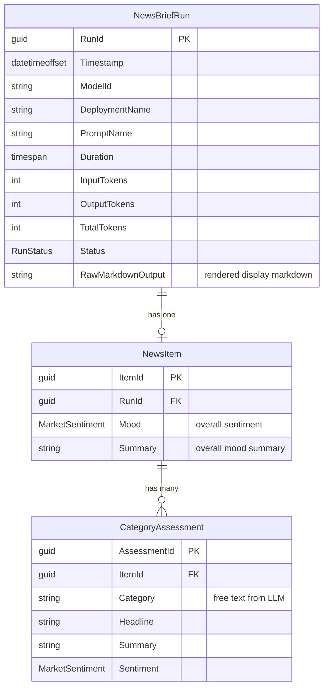
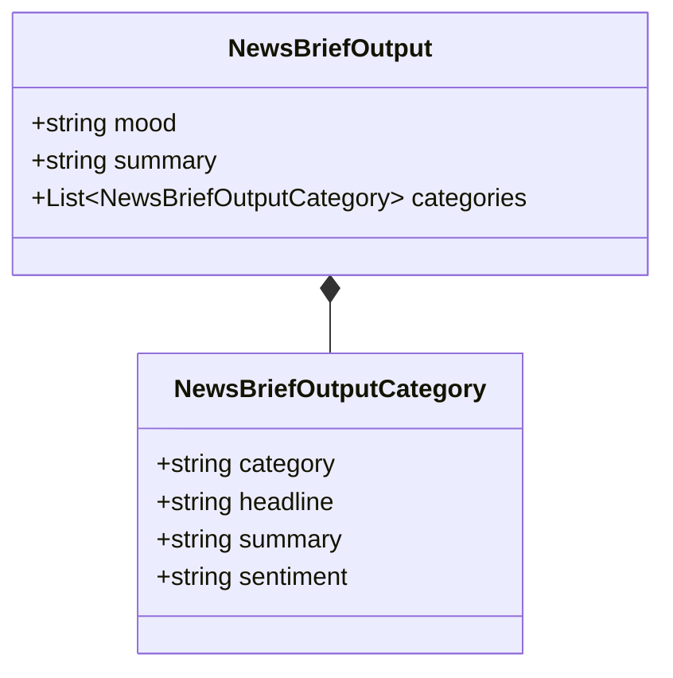
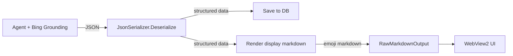

# Step 1 — News Brief Agent

**Role:** Market-Moving News Analyst

Scans the last 14 days of global news and extracts only what matters for financial markets. This is the first step in the pipeline — its output feeds into downstream agents for analysis.

---

## Trigger

**Schedule:** Daily (once per day, e.g., 07:00 UTC)

No DB dependency — this step kicks off the pipeline.

---

## Input

| Source | Table | What |
| --- | --- | --- |
| Web | *(none — Bing Grounding)* | Searches the last 14 days of global news autonomously |
| Config | *(app config)* | `{current_date}` injected into the prompt |

No database input. The agent's only input is the current date and live web search results via Bing Grounding.

---

## Agent Prompt

The agent returns **JSON** (not markdown). This makes parsing deterministic — `JsonSerializer.Deserialize` instead of fragile regex over variable LLM output. Display markdown with emojis is rendered from the structured data by the application.

```text
You are a sharp financial intelligence analyst. Your job is to scan the last 14 days of global news and extract only what matters for financial markets.

Every time you run, you will:

1. Search the web for major news from the past 2 weeks across these categories:
   - Macroeconomics (inflation, GDP, employment data)
   - Central banks (Fed, ECB, BOJ, BOE decisions or signals)
   - Geopolitics (wars, sanctions, trade disputes, elections)
   - Energy & commodities (oil, gas, metals)
   - Tech & AI (major earnings, regulations, breakthroughs)
   - Corporate (major earnings surprises, bankruptcies, M&A)
   - Financial system (credit events, banking stress, currency moves)

2. For each relevant item, write one sentence max: what happened + why it matters for markets.

3. Flag the market impact direction per category: RiskOff / RiskOn / Mixed

4. Assess the overall market mood: dominant sentiment + two-line summary.

Rules:
- No fluff. No background context. No history lessons.
- If something has no clear market implication, skip it.
- Prioritize surprises and changes over expected events.
- Only include events based on official data releases, central bank statements, confirmed corporate actions, or wire reports.
- Ignore opinion pieces, forecasts, and "analyst expects" framing.
- If an item is based solely on unnamed sources or speculation, skip it entirely.
- Do not use citation markers like 【source】 or inline source references.
- Today's date is {current_date}.

Respond ONLY with a JSON object (no markdown, no commentary). Use this exact schema:
{
  "mood": "RiskOff|RiskOn|Mixed",
  "summary": "Two-line overall market mood summary",
  "categories": [
    {
      "category": "Category name (free text, e.g. Geopolitics / Energy, Central Banks, Macro / Inflation)",
      "headline": "One-line headline",
      "summary": "What happened + why it matters for markets",
      "sentiment": "RiskOff|RiskOn|Mixed"
    }
  ]
}
```

---

## Example Input

The agent receives no user input beyond the current date. It autonomously searches the web for recent news.

```json
{
  "current_date": "2026-03-18"
}
```

---

## Example Output (JSON from LLM)

The agent returns JSON. The application deserializes it, saves structured data to the DB, and renders display markdown with emojis for the WebView2 UI.

```json
{
  "mood": "RiskOff",
  "summary": "Risk-off, with pockets of resilience. The Iran war has repriced the macro outlook — stagflation risk is back, rate cut hopes are evaporating, and energy/inflation dominate.",
  "categories": [
    {
      "category": "Geopolitics / Energy",
      "headline": "US-Israel war on Iran disrupting Strait of Hormuz",
      "summary": "Energy and goods flow through Hormuz partially disrupted; IEA emergency release of ~400M reserve barrels provided limited relief. Supply chain shock feeding into production costs globally.",
      "sentiment": "RiskOff"
    },
    {
      "category": "Geopolitics / Energy",
      "headline": "Brent crude back above $100",
      "summary": "US crude above $96/barrel, Brent above $100 on Tuesday. Stagflation fears mounting.",
      "sentiment": "RiskOff"
    },
    {
      "category": "Central Banks",
      "headline": "Fed expected to hold at 3.5-3.75%",
      "summary": "Markets focused on updated dot-plot projections and hawkish language on inflation.",
      "sentiment": "RiskOff"
    },
    {
      "category": "Central Banks",
      "headline": "Rate cut expectations evaporating",
      "summary": "Probability of Fed hold through June rose from 31% to 77%; some economists see zero cuts in 2026.",
      "sentiment": "RiskOff"
    },
    {
      "category": "Macro / Inflation",
      "headline": "US producer prices above expectations",
      "summary": "February producer prices rose more than twice as fast as expected, ahead of March data reflecting the full oil shock.",
      "sentiment": "RiskOff"
    },
    {
      "category": "Macro / Inflation",
      "headline": "Consumer sentiment fell to 55.5",
      "summary": "Expectations sub-index down 4.4% as war weighed on confidence.",
      "sentiment": "RiskOff"
    },
    {
      "category": "Macro / Inflation",
      "headline": "30-year mortgage rate jumped to 6.26%",
      "summary": "Bond markets pricing in higher inflation; rate jumped from below 6% in two weeks.",
      "sentiment": "RiskOff"
    },
    {
      "category": "Equities",
      "headline": "S&P 500 hit 2026 low",
      "summary": "Third consecutive weekly loss on March 13; partial recovery Mon-Tue on tentative war optimism.",
      "sentiment": "RiskOff"
    },
    {
      "category": "Tech / AI",
      "headline": "Nvidia unveiled Vera Rubin Space-1 at GTC 2026",
      "summary": "Targeting orbital AI infrastructure. Bullish signal for AI capex.",
      "sentiment": "RiskOn"
    },
    {
      "category": "Tech / AI",
      "headline": "Amazon CEO projects AWS at $600B over 10 years",
      "summary": "Double prior estimate; AI-driven growth narrative building.",
      "sentiment": "RiskOn"
    },
    {
      "category": "Corporate",
      "headline": "Muddy Waters shorts SoFi Technologies",
      "summary": "Alleges $312M in unrecorded debt and potential material misstatements; shares fell ~5%.",
      "sentiment": "RiskOff"
    }
  ]
}
```

### Rendered Display (generated by application)

The application renders the structured data back into emoji markdown for the WebView2 UI:

```text
MARKET-MOVING NEWS BRIEF — March 18, 2026

---

🔴 GEOPOLITICS / ENERGY

- **US-Israel war on Iran disrupting Strait of Hormuz** — Energy and goods flow through
  Hormuz partially disrupted; IEA emergency release provided limited relief.
- **Brent crude back above $100** — Stagflation fears mounting.

🔴 CENTRAL BANKS

- **Fed expected to hold at 3.5-3.75%** — Markets focused on dot-plot and hawkish signals.
- **Rate cut expectations evaporating** — Probability of hold through June rose to 77%.

🔴 MACRO / INFLATION

- **US producer prices above expectations** — February data rose twice as fast as expected.
- **Consumer sentiment fell to 55.5** — Expectations sub-index down 4.4%.
- **30-year mortgage rate jumped to 6.26%** — Bond markets pricing in higher inflation.

🔴 EQUITIES

- **S&P 500 hit 2026 low** — Third consecutive weekly loss; partial recovery on war optimism.

🟢 TECH / AI

- **Nvidia unveiled Vera Rubin Space-1 at GTC 2026** — Bullish signal for AI capex.
- **Amazon CEO projects AWS at $600B over 10 years** — AI-driven growth narrative building.

🔴 CORPORATE

- **Muddy Waters shorts SoFi Technologies** — Alleges $312M unrecorded debt; shares fell ~5%.

---

OVERALL MOOD: 🔴 Risk-off, with pockets of resilience. Stagflation risk is back, rate cut
hopes evaporating, energy and inflation dominate.
```

---

## Output

### LLM Response Schema

The agent returns a **JSON object** with these fields:

| Field | Required | Description |
| --- | --- | --- |
| `mood` | Yes | Overall dominant sentiment: `RiskOff`, `RiskOn`, or `Mixed` |
| `summary` | Yes | Two-line overall market mood summary |
| `categories` | Yes | Array of per-category news items |
| `categories[].category` | Yes | Free text category name (e.g., "Geopolitics / Energy", "Central Banks", "Macro / Inflation") |
| `categories[].headline` | Yes | One-line headline |
| `categories[].summary` | Yes | What happened + why it matters for markets |
| `categories[].sentiment` | Yes | Per-item impact: `RiskOff`, `RiskOn`, or `Mixed` |

### Data Model



### Output JSON Schema



### Persistence

| Purpose | Table | Key Columns | Notes |
| --- | --- | --- | --- |
| Save run metadata | `NewsBriefRuns` | RunId, Timestamp, ModelId, DeploymentName, PromptName, Duration, InputTokens, OutputTokens, TotalTokens, Status, **RawMarkdownOutput** | One row per agent run. `RawMarkdownOutput` contains rendered display markdown (generated from structured data). |
| Save overall mood | `NewsItems` | ItemId, RunId (FK), Mood (MarketSentiment), Summary | One row per run. Overall market mood and summary. |
| Save per-category data (for Step 2) | `CategoryAssessments` | AssessmentId, ItemId (FK), Category (string), Headline, Summary, Sentiment (MarketSentiment) | One row per category item. Category is free text from the LLM. Step 2 reads these to build daily briefs. |

### Processing Pipeline



**Parsing:** JSON deserialization is deterministic (not an LLM call). The application renders display markdown from the structured data — consistent formatting every run.

### Output Configuration

The Foundry Agent Service SDK enforces JSON output at the API level via `PromptAgentDefinition.TextOptions`. This guarantees valid JSON — no prompt-only "please return JSON" needed.

**SDK:** `Azure.AI.Projects.Agents` (`PromptAgentDefinition` class)

**Property chain:** `PromptAgentDefinition.TextOptions` → `ResponseTextOptions.Format` → `json_schema`

```csharp
var agentDefinition = new PromptAgentDefinition(model: model.DeploymentName)
{
    Instructions = systemPrompt,
    TextOptions = new ResponseTextOptions
    {
        Format = ResponseTextFormat.CreateJsonSchemaFormat(
            name: "NewsBriefOutput",
            jsonSchema: BinaryData.FromString(jsonSchemaString),
            strict: true)
    }
};
```

**Why not Microsoft Agent Framework?** Step 1 requires Bing Grounding — a server-side tool that only runs inside the Foundry Agent Service. Steps 2--4 don't search the web and could use either approach. The Agent Framework can orchestrate Foundry-hosted agents locally when multi-agent orchestration is needed later.

For the full data model (Step 1 + Step 2 tables), see [Step 2 — Data Model](step2-weekly-summary-agent.md#data-model).

---

## Downstream Consumers

- **Step 2** — [Weekly Summary Agent](step2-weekly-summary-agent.md) (aggregates daily briefs into confidence-weighted weekly summary)
