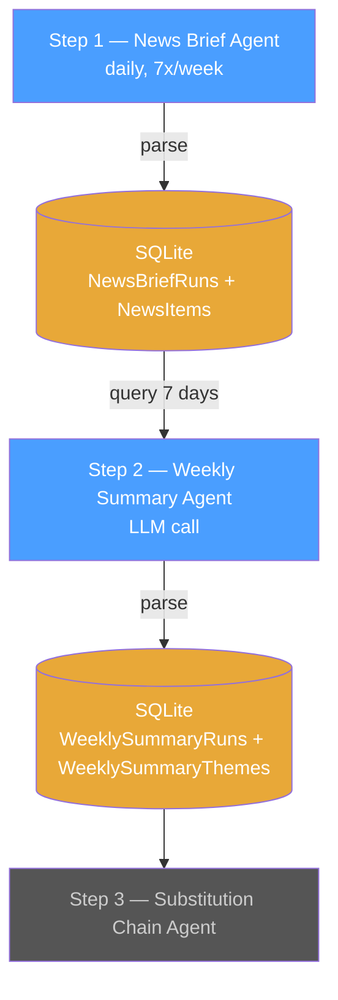
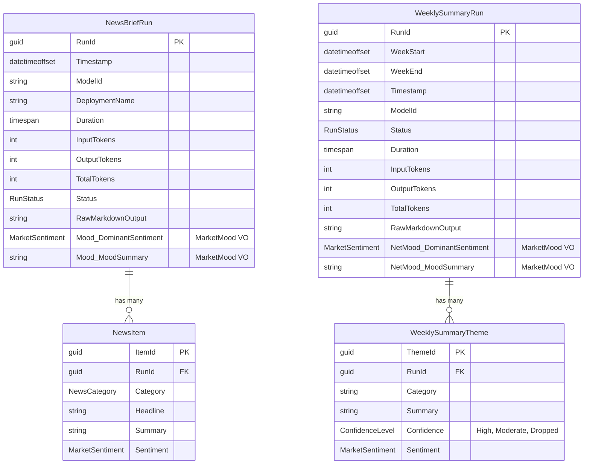
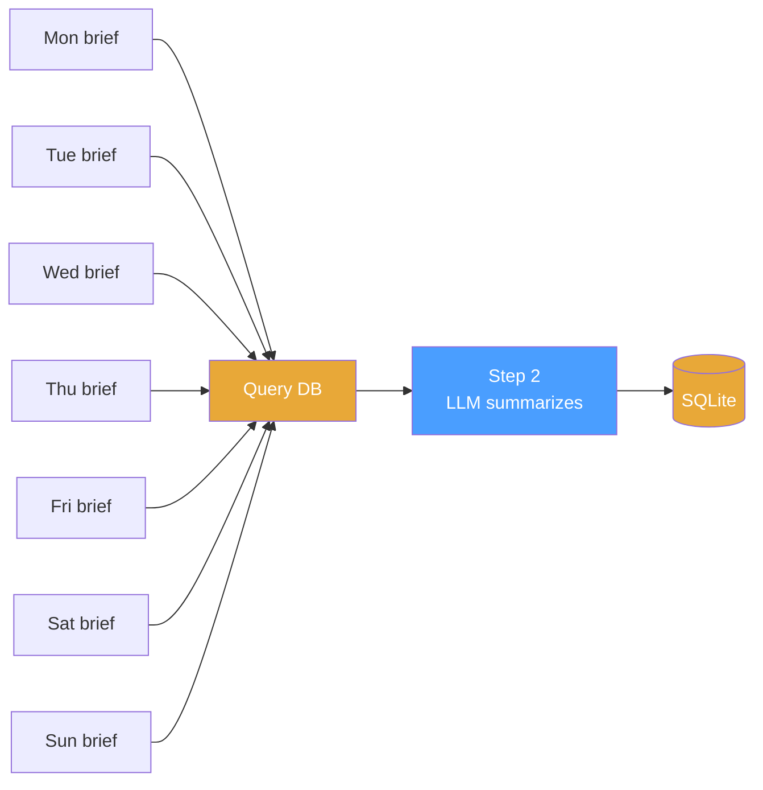

# Step 2 — Weekly Summary Agent

**Role:** Weekly Market Summarizer

Reads 7 days of structured `NewsItems` rows from the database, asks the LLM to consolidate them into a confidence-weighted weekly summary, and saves the result back to the DB. Run-to-run inconsistency becomes a confidence filter — persistent themes survive, noise gets dropped.

---

## Pipeline Position



Every step follows the same pattern: **DB → text → LLM → response → DB.** No cross-LLM calls between steps. The database is the only interface.

---

## Trigger

**Schedule:** Weekly (once per week, e.g., Sunday 20:00 UTC — after daily briefs have accumulated)

**Precondition:** At least 5 distinct calendar days with a completed `NewsBriefRun` from the default model exist for the current week. Step 1 runs multiple models in parallel for comparison — only the default model's runs feed the pipeline.

---

## Input

| Source | Table | What |
| --- | --- | --- |
| DB | `NewsBriefRuns` | 5--7 daily runs from the default model for the current week (Timestamp, Mood) |
| DB | `NewsItems` | All news items from those runs (Category, Headline, Summary, Sentiment) |

The application queries 5--7 days of `NewsItems` rows from the default model's runs, groups them by day, and formats them as text for the LLM prompt. See [Example Input](#example-input) below.

---

## Data Model

Steps 1--2 data flow. Step 1 stores raw markdown + parsed structured data. Step 2 reads that structured data and produces its own raw + structured output.



`NewsBriefRun` + `NewsItem` are **Step 1 output / Step 2 input.** `WeeklySummaryRun` + `WeeklySummaryTheme` are **Step 2 output / Step 3 input.**

---

## The Confidence Filter

Running the brief daily for 5--7 days and aggregating turns run-to-run inconsistency into a **confidence signal**:



**Aggregation rules:**

| Persistence | Confidence | Action |
| --- | --- | --- |
| Theme appeared 70%+ of available days | High | Include with strong weight |
| Theme appeared 40--69% of available days | Moderate | Include with caveat |
| Theme appeared less than 40% of available days | Low | Drop — likely noise |
| Contradictory signals (e.g. 3x hawkish, 3x accommodative) | Inconsistent | Drop — not a reliable signal |

**Why this works:**

- One brief says BoJ hawkish, next says accommodative → inconsistent → **dropped**
- Five briefs say oil rising on Iran → persistent → **high weight**
- SpaceX IPO appears Monday only → one-off → **dropped**

---

## Agent Prompt

```text
You are a weekly market summarizer. You will receive 5--7 daily market briefs (structured by news category). Your job is to consolidate them into a single weekly summary with confidence levels.

For each news category that appeared during the week:
1. Count how many of the available days it appeared.
2. Check if the sentiment direction was consistent across days.
3. Classify confidence: High (appeared 70%+ of days, consistent), Moderate (40--69% of days), Low (less than 40%), or Inconsistent (contradictory signals).

Output:
- HIGH CONFIDENCE themes with their persistent signals.
- MODERATE CONFIDENCE themes with caveats.
- DROPPED themes (low confidence or inconsistent) — list them briefly so the user knows what was filtered out.
- NET WEEKLY MOOD: the dominant sentiment across the week.

Rules:
- Do not search the web. Work only with the provided daily briefs.
- Merge semantically similar themes across days (e.g. "Fed holds rates" and "Fed signals hawkish pause" are the same theme).
- If a theme flipped direction during the week, mark it as Inconsistent and drop it.
- Be concise — this summary feeds into downstream agents, not human readers.
- Today's date is {current_date}.
```

---

## Example Input

The input is **built from a DB query** of 7 days of `NewsItems` rows. The application reads the rows, groups them by day, and formats them as text:

```text
DAILY BRIEFS — Week of March 12--18, 2026

---

MONDAY March 12:
🔴 GEOPOLITICS / ENERGY: Iran war escalation, Hormuz disruption, Brent above $96.
🔴 CENTRAL BANKS: Fed expected to hold at 3.5--3.75%. Rate cut probability dropping.
🔴 MACRO / INFLATION: Producer prices above expectations.
🟢 TECH / AI: NVIDIA GTC preview, AI capex narrative building.

TUESDAY March 13:
🔴 GEOPOLITICS / ENERGY: Hormuz disruption ongoing, IEA emergency release announced.
🔴 CENTRAL BANKS: Fed holds, hawkish dot-plot signals.
🔴 MACRO / INFLATION: Consumer sentiment fell to 55.5.
🔴 EQUITIES: S&P 500 hits 2026 low.

WEDNESDAY March 14:
🔴 GEOPOLITICS / ENERGY: Brent above $100. Supply chain shock spreading.
🔴 CENTRAL BANKS: ECB, BOE, Riksbank expected to hold.
🔴 MACRO / INFLATION: 30-year mortgage jumped to 6.26%.
🟢 TECH / AI: NVIDIA Vera Rubin Space-1 unveiled at GTC.

THURSDAY March 15:
🔴 GEOPOLITICS / ENERGY: Hormuz disruption, oil above $98.
🔴 CENTRAL BANKS: Rate cut expectations evaporating — hold probability 77% through June.
🟡 EQUITIES: Partial recovery on tentative war optimism.

FRIDAY March 16:
🔴 GEOPOLITICS / ENERGY: Oil steady above $96.
🔴 MACRO / INFLATION: Mortgage rates sustained at 6.26%.
🟢 TECH / AI: Amazon CEO projects AWS at $600B over 10 years.

SATURDAY March 17:
🔴 GEOPOLITICS / ENERGY: No change — Hormuz still disrupted.
🔴 CENTRAL BANKS: SNB expected to hold.

SUNDAY March 18:
🔴 GEOPOLITICS / ENERGY: Brent back above $100.
🔴 CORPORATE: SoFi short report — Muddy Waters alleges misstatements.
```

---

## Example Output

```text
WEEKLY MARKET SUMMARY — Week of March 12--18, 2026

---

HIGH CONFIDENCE (5+ of 7 days):

🔴 GEOPOLITICS / ENERGY
- Iran war / Strait of Hormuz disruption (7/7 days)
- Brent crude above $96--100 (6/7 days)
- IEA emergency reserve release provided limited relief (5/7 days)

🔴 CENTRAL BANKS
- Fed holding rates at 3.5--3.75%, hawkish signals (6/7 days)
- Rate cut expectations evaporating — probability of hold through June rose to 77% (5/7 days)
- ECB, BOE, Riksbank, SNB expected to hold (5/7 days)

🔴 MACRO / INFLATION
- US producer prices above expectations (5/7 days)
- Consumer sentiment declining, expectations sub-index down (5/7 days)
- 30-year mortgage rate jumped to 6.26% (5/7 days)

MODERATE CONFIDENCE (3--4 of 7 days):

🟢 TECH / AI
- NVIDIA GTC announcements / AI capex cycle (4/7 days)
- Amazon AWS $600B projection (3/7 days)

🔴 EQUITIES
- S&P 500 at 2026 lows, third consecutive weekly loss (4/7 days)

DROPPED (low confidence / inconsistent):
- BoJ policy direction (2x hawkish, 2x accommodative — contradictory)
- SoFi short report (1/7 days — one-off)

---

NET WEEKLY MOOD: 🔴 Risk-off (5/7 days risk-off dominant)
Stagflation risk back on the table. Rate cut hopes evaporating. Energy and inflation dominate.
```

---

## Output

### LLM Response Schema

| Section | Required | Description |
| --- | --- | --- |
| High confidence themes | Yes | Themes that appeared 70%+ of available days with consistent direction |
| Moderate confidence themes | Yes | Themes that appeared 40--69% of available days |
| Dropped themes | Yes | Low confidence or inconsistent — listed so downstream knows what was filtered |
| Net weekly mood | Yes | Dominant sentiment + one-line summary |

### Persistence

| Purpose | Table | Key Columns | Notes |
| --- | --- | --- | --- |
| Save raw LLM response | `WeeklySummaryRuns` | RunId, WeekStart, WeekEnd, Timestamp, ModelId, Status, Duration, InputTokens, OutputTokens, TotalTokens, **RawMarkdownOutput** | One row per weekly run. Raw markdown stored for audit/replay. |
| Save structured data (for Step 3) | `WeeklySummaryThemes` | ThemeId, RunId (FK), Category, Summary, Confidence (High/Moderate/Dropped), Sentiment (MarketSentiment) | One row per theme. Parsed from the raw markdown output. |
| Save weekly mood | `WeeklySummaryRuns.NetMood` | DominantSentiment, MoodSummary | MarketMood value object, owned by WeeklySummaryRun. |

This agent does **not** search the web. Input is built from structured database rows saved by Step 1.

---

## Downstream Consumers

- **Step 3** — [Substitution Chain Agent](step3-substitution-chain-agent.md) (follows capital rotation chains based on weekly signals)
- **Trend analysis** — `WeeklySummaryThemes` rows are timestamped via their parent `WeeklySummaryRun`. Querying the same category across multiple weeks reveals persistent themes (e.g. "Central Banks hawkish for 4 consecutive weeks") vs one-off noise.
