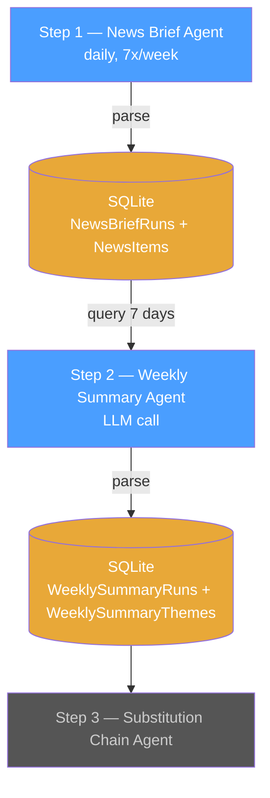
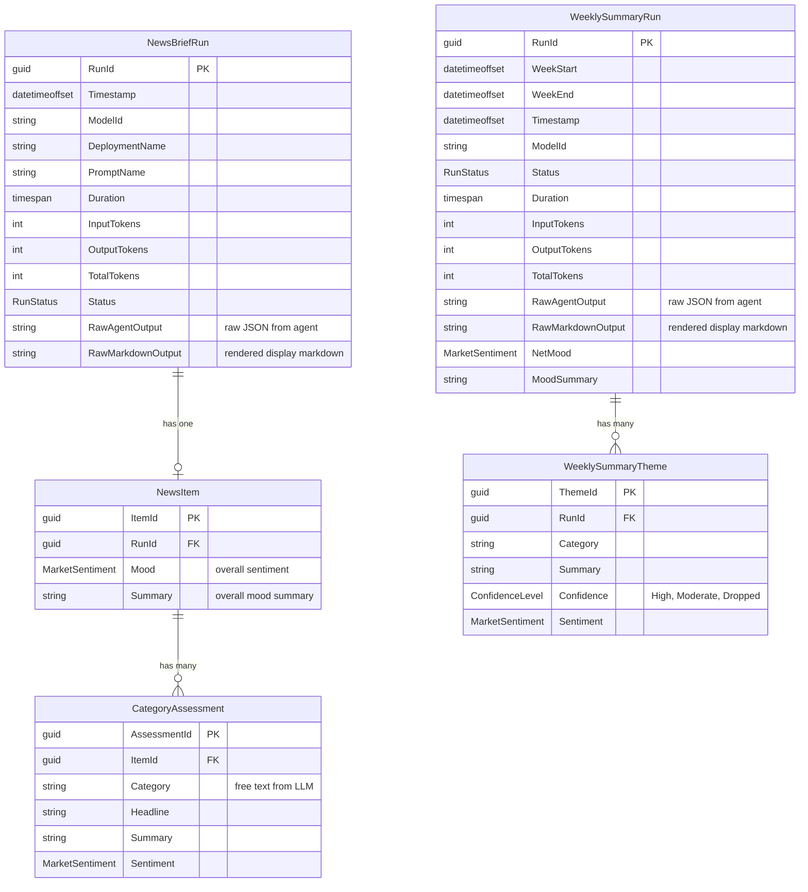
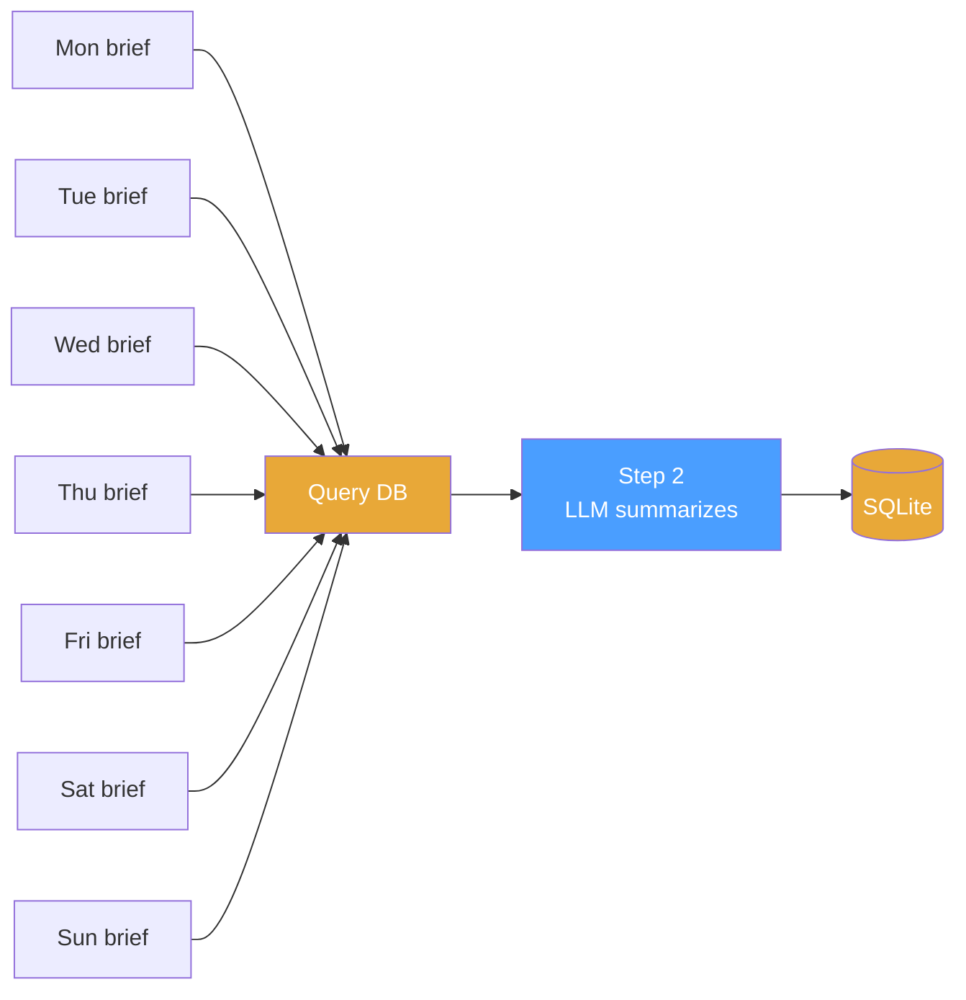
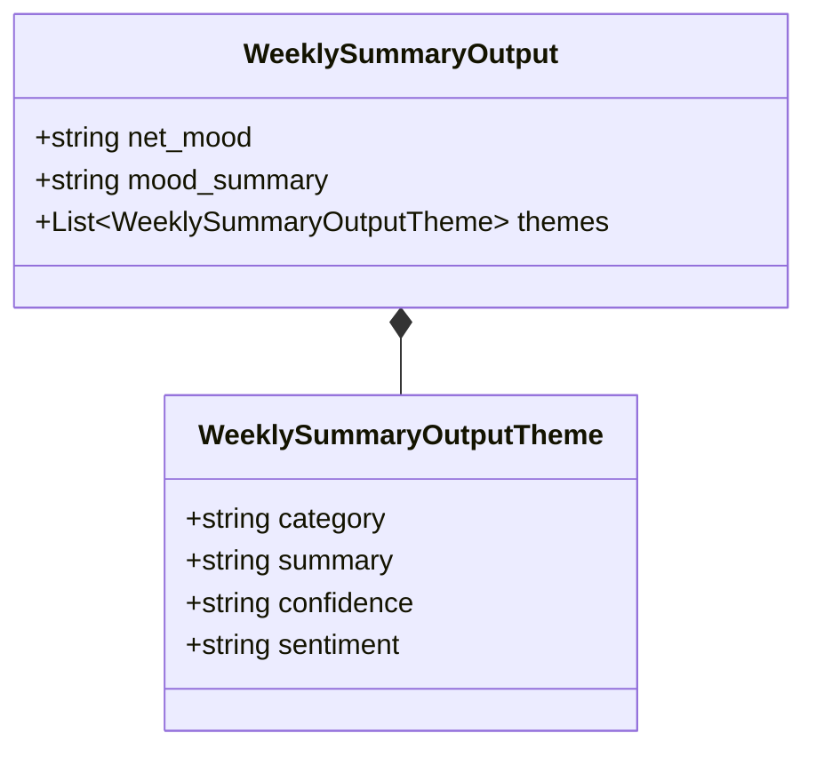
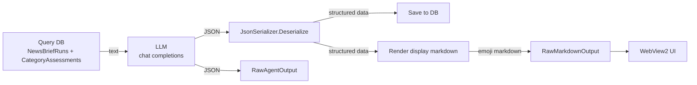

# Step 2 — Weekly Summary Agent

**Role:** Weekly Market Summarizer

Reads recent daily briefs from the database, asks the LLM to consolidate them into a confidence-weighted weekly summary, and saves the result back to the DB.
Run-to-run inconsistency becomes a confidence filter — persistent themes survive, noise gets dropped.

---

## Pipeline Position



Every step follows the same pattern: **DB → text → LLM → response → DB.** No cross-LLM calls between steps. The database is the only interface.

---

## Trigger

**Schedule:** Weekly (once per week, e.g., Sunday 20:00 UTC — after daily briefs have accumulated). Can also be triggered manually from the app at any time.

Step 1 runs multiple models in parallel for comparison — only the **default model's** runs feed the pipeline.
The confidence filter works with however many days are available; more days means stronger signal.

---

## Input

| Source | Table | What |
| --- | --- | --- |
| DB | `NewsBriefRuns` | Recent daily runs from the default model (filter by ModelId + Status = Success) |
| DB | `NewsItems` | Overall mood and summary per run (Mood, Summary) |
| DB | `CategoryAssessments` | Per-category news items from those runs (Category, Headline, Summary, Sentiment) |

The application queries recent `NewsBriefRuns` from the default model, eager-loads `Item` (NewsItem) and `Item.Assessments` (CategoryAssessments).
Results are grouped by day and formatted as text for the LLM prompt. See [Example Input](#example-input) below.

---

## Data Model

Steps 1--2 data flow. Step 1 stores raw JSON + parsed structured data. Step 2 reads that structured data and produces its own raw JSON + structured output.



`NewsBriefRun` + `NewsItem` + `CategoryAssessment` are **Step 1 output / Step 2 input.** `WeeklySummaryRun` + `WeeklySummaryTheme` are **Step 2 output / Step 3 input.**

---

## The Confidence Filter

Running the brief daily for 5--7 days and aggregating turns run-to-run inconsistency into a **confidence signal**:



**Aggregation rules:**

| Persistence | Confidence | Action |
| --- | --- | --- |
| Theme appeared 70%+ of available days | High | Include with strong weight |
| Theme appeared 40--69% of available days | Moderate | Include with caveat |
| Theme appeared less than 40% of available days | Low | Drop — likely noise |
| Contradictory signals (e.g. 3x hawkish, 3x accommodative) | Inconsistent | Drop — not a reliable signal |

**Why this works:**

- One brief says BoJ hawkish, next says accommodative → inconsistent → **dropped**
- Five briefs say oil rising on Iran → persistent → **high weight**
- SpaceX IPO appears Monday only → one-off → **dropped**

---

## Agent Prompt

The agent returns **JSON** (not markdown). This makes parsing deterministic — `JsonSerializer.Deserialize` instead of fragile regex over variable LLM output.
Display markdown with emojis is rendered from the structured data by the application.

```text
You are a weekly market summarizer. You will receive daily market briefs (structured by news category).
Your job is to consolidate them into a single weekly summary with confidence levels.

For each news category that appeared during the week:
1. Count how many of the available days it appeared.
2. Check if the sentiment direction was consistent across days.
3. Classify confidence:
   - High: appeared 70%+ of days, consistent direction
   - Moderate: appeared 40--69% of days
   - Dropped: appeared less than 40% of days, or contradictory signals

Rules:
- Do not search the web. Work only with the provided daily briefs.
- Merge semantically similar themes across days
  (e.g. "Fed holds rates" and "Fed signals hawkish pause" are the same theme).
- If a theme flipped direction during the week, mark it as Dropped.
- Be concise — this summary feeds into downstream agents, not human readers.
- Today's date is {current_date}.

Respond ONLY with a JSON object (no markdown, no commentary). Use this exact schema:
{
  "net_mood": "RiskOff|RiskOn|Mixed",
  "mood_summary": "One-line net weekly mood summary",
  "themes": [
    {
      "category": "Category name (free text, e.g. Geopolitics / Energy, Central Banks)",
      "summary": "Consolidated summary of the theme across the week",
      "confidence": "High|Moderate|Dropped",
      "sentiment": "RiskOff|RiskOn|Mixed"
    }
  ]
}
```

---

## Example Input

The input is **built from a DB query** of `NewsBriefRuns` + `CategoryAssessments`. The application reads the rows, groups by day, and formats as text:

```text
DAILY BRIEFS — Week of March 12--18, 2026

---

MONDAY March 12:
🔴 GEOPOLITICS / ENERGY: Iran war escalation, Hormuz disruption, Brent above $96.
🔴 CENTRAL BANKS: Fed expected to hold at 3.5--3.75%. Rate cut probability dropping.
🔴 MACRO / INFLATION: Producer prices above expectations.
🟢 TECH / AI: NVIDIA GTC preview, AI capex narrative building.

TUESDAY March 13:
🔴 GEOPOLITICS / ENERGY: Hormuz disruption ongoing, IEA emergency release announced.
🔴 CENTRAL BANKS: Fed holds, hawkish dot-plot signals.
🔴 MACRO / INFLATION: Consumer sentiment fell to 55.5.
🔴 EQUITIES: S&P 500 hits 2026 low.

WEDNESDAY March 14:
🔴 GEOPOLITICS / ENERGY: Brent above $100. Supply chain shock spreading.
🔴 CENTRAL BANKS: ECB, BOE, Riksbank expected to hold.
🔴 MACRO / INFLATION: 30-year mortgage jumped to 6.26%.
🟢 TECH / AI: NVIDIA Vera Rubin Space-1 unveiled at GTC.

THURSDAY March 15:
🔴 GEOPOLITICS / ENERGY: Hormuz disruption, oil above $98.
🔴 CENTRAL BANKS: Rate cut expectations evaporating — hold probability 77% through June.
🟡 EQUITIES: Partial recovery on tentative war optimism.

FRIDAY March 16:
🔴 GEOPOLITICS / ENERGY: Oil steady above $96.
🔴 MACRO / INFLATION: Mortgage rates sustained at 6.26%.
🟢 TECH / AI: Amazon CEO projects AWS at $600B over 10 years.

SATURDAY March 17:
🔴 GEOPOLITICS / ENERGY: No change — Hormuz still disrupted.
🔴 CENTRAL BANKS: SNB expected to hold.

SUNDAY March 18:
🔴 GEOPOLITICS / ENERGY: Brent back above $100.
🔴 CORPORATE: SoFi short report — Muddy Waters alleges misstatements.
```

---

## Example Output (JSON from LLM)

The agent returns JSON. The application deserializes it, saves structured data to the DB, and renders display markdown with emojis for the WebView2 UI.

```json
{
  "net_mood": "RiskOff",
  "mood_summary": "Risk-off dominant. Stagflation risk back on the table, rate cut hopes evaporating, energy and inflation dominate.",
  "themes": [
    {
      "category": "Geopolitics / Energy",
      "summary": "Iran war / Strait of Hormuz disruption drove Brent above $96-100. IEA emergency reserve release provided limited relief.",
      "confidence": "High",
      "sentiment": "RiskOff"
    },
    {
      "category": "Central Banks",
      "summary": "Fed holding at 3.5-3.75% with hawkish signals. Rate cut expectations evaporating. ECB, BOE, Riksbank, SNB expected to hold.",
      "confidence": "High",
      "sentiment": "RiskOff"
    },
    {
      "category": "Macro / Inflation",
      "summary": "US producer prices above expectations. Consumer sentiment declining. 30-year mortgage rate jumped to 6.26%.",
      "confidence": "High",
      "sentiment": "RiskOff"
    },
    {
      "category": "Tech / AI",
      "summary": "NVIDIA GTC announcements and AI capex cycle. Amazon AWS $600B projection.",
      "confidence": "Moderate",
      "sentiment": "RiskOn"
    },
    {
      "category": "Equities",
      "summary": "S&P 500 at 2026 lows, third consecutive weekly loss.",
      "confidence": "Moderate",
      "sentiment": "RiskOff"
    },
    {
      "category": "BoJ Policy",
      "summary": "Contradictory signals — hawkish and accommodative on different days.",
      "confidence": "Dropped",
      "sentiment": "Mixed"
    },
    {
      "category": "Corporate",
      "summary": "SoFi short report — one-off, single day only.",
      "confidence": "Dropped",
      "sentiment": "RiskOff"
    }
  ]
}
```

### Rendered Display (generated by application)

The application renders the structured data back into emoji markdown for the WebView2 UI:

```text
WEEKLY MARKET SUMMARY — Week of March 12--18, 2026

---

HIGH CONFIDENCE:

🔴 GEOPOLITICS / ENERGY
- Iran war / Strait of Hormuz disruption drove Brent above $96-100.
  IEA emergency reserve release provided limited relief.

🔴 CENTRAL BANKS
- Fed holding at 3.5-3.75% with hawkish signals. Rate cut expectations
  evaporating. ECB, BOE, Riksbank, SNB expected to hold.

🔴 MACRO / INFLATION
- US producer prices above expectations. Consumer sentiment declining.
  30-year mortgage rate jumped to 6.26%.

MODERATE CONFIDENCE:

🟢 TECH / AI
- NVIDIA GTC announcements and AI capex cycle. Amazon AWS $600B projection.

🔴 EQUITIES
- S&P 500 at 2026 lows, third consecutive weekly loss.

DROPPED:
- BoJ Policy — contradictory signals
- Corporate — SoFi short report (one-off)

---

NET WEEKLY MOOD: 🔴 Risk-off
Stagflation risk back on the table. Rate cut hopes evaporating. Energy and inflation dominate.
```

---

## Output

### LLM Response Schema

The agent returns a **JSON object** with these fields:

| Field | Required | Description |
| --- | --- | --- |
| `net_mood` | Yes | Dominant weekly sentiment: `RiskOff`, `RiskOn`, or `Mixed` |
| `mood_summary` | Yes | One-line net weekly mood summary |
| `themes` | Yes | Array of per-category themes with confidence levels |
| `themes[].category` | Yes | Free text category name (e.g., "Geopolitics / Energy", "Central Banks") |
| `themes[].summary` | Yes | Consolidated summary of the theme across the week |
| `themes[].confidence` | Yes | `High`, `Moderate`, or `Dropped` |
| `themes[].sentiment` | Yes | Per-theme impact: `RiskOff`, `RiskOn`, or `Mixed` |

### Output JSON Schema



### Processing Pipeline



**Two outputs stored per run:**

- `RawAgentOutput` — the original JSON from the agent, preserved for audit
- `RawMarkdownOutput` — rendered display markdown with emojis, generated from the structured data by the application

**Parsing:** JSON deserialization is deterministic (not an LLM call). The application renders display markdown from the structured data — consistent formatting every run.

### Persistence

| Purpose | Table | Key Columns | Notes |
| --- | --- | --- | --- |
| Save run metadata | `WeeklySummaryRuns` | RunId, WeekStart, WeekEnd, Timestamp, ModelId, Status, Duration, InputTokens, OutputTokens, TotalTokens, **RawAgentOutput**, **RawMarkdownOutput**, NetMood, MoodSummary | One row per weekly run. |
| Save structured themes (for Step 3) | `WeeklySummaryThemes` | ThemeId, RunId (FK), Category, Summary, Confidence (ConfidenceLevel), Sentiment (MarketSentiment) | One row per theme. Parsed from the raw JSON output. |

This agent does **not** search the web. Input is built from structured database rows saved by Step 1.

---

## Downstream Consumers

- **Step 3** — [Substitution Chain Agent](step3-substitution-chain-agent.md) (follows capital rotation chains based on weekly signals)
- **Trend analysis** — `WeeklySummaryThemes` rows are timestamped via their parent `WeeklySummaryRun`. Querying the same category across multiple weeks reveals persistent themes (e.g. "Central Banks hawkish for 4 consecutive weeks") vs one-off noise.
