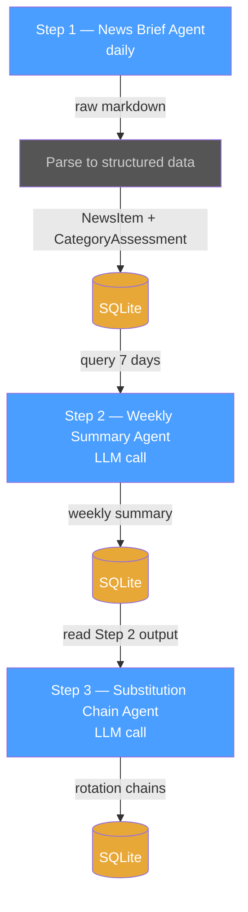
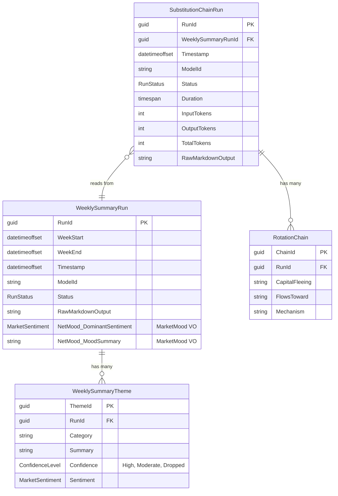

# Step 3 — Substitution Chain Agent

**Role:** Substitution and Beneficiary Analyst

Identifies what sectors, commodities, or themes benefit as capital rotates away from affected areas. Follows the full substitution chain — not just first-order effects, but the complete rotation path to who ultimately profits. Does not search the web — reasons over the Step 2 category impact map only.

---

## Pipeline Position



Every step follows the same pattern: **DB → text → LLM → response → DB.** No cross-LLM calls between steps. The database is the only interface.

---

## Trigger

**Chained:** Runs immediately after Step 2 completes successfully.

**Precondition:** A `WeeklySummaryRuns` row with Status = Completed exists for the current week.

---

## Input

| Source | Table | What |
| --- | --- | --- |
| DB | `WeeklySummaryRuns` | Latest completed weekly summary (RawMarkdownOutput) |
| DB | `WeeklySummaryThemes` | Structured themes with confidence levels (used to build the prompt text) |

The application queries the latest `WeeklySummaryRun` and formats its content as text for the LLM prompt. See [Example Input](#example-input) below.

---

## Data Model

Step 3 reads Step 2's output and produces its own tables. For the full Step 1 + Step 2 data model, see [Step 2 — Data Model](step2-weekly-summary-agent.md#data-model).



`WeeklySummaryRun` + `WeeklySummaryTheme` are **Step 2 output / Step 3 input.** `SubstitutionChainRun` + `RotationChain` are **Step 3 output / Step 4 input.**

---

## Step 2 — Weekly Summary Agent (upstream)

Step 2 reads 7 days of `NewsItems` rows from the DB, builds a text prompt, and asks the LLM to summarize with confidence filtering. Its output is saved to the DB — that saved output is what Step 3 reads.

See [Step 2 — Weekly Summary Agent](step2-weekly-summary-agent.md) for full details.

---

## Agent Prompt

```text
You are a substitution and beneficiary analyst. Given a weekly summary of market-moving news (aggregated from 7 daily briefs), your job is to identify what sectors, commodities, or themes benefit as capital rotates away from the affected areas.

You will receive:
1. A weekly market summary organized by news category, with confidence levels based on how consistently each theme appeared across the week.
2. The net market mood for the week.

You MUST assess every news category present in the input. Do not skip any.

For each high-confidence disruption or pressure in the input, follow the full substitution chain:
- What is being disrupted or pressured?
- What replaces it or absorbs the capital flow?
- Who profits from that rotation?
- Which fund categories capture that profit?

Then produce a summary substitution table showing: capital fleeing → flows toward → mechanism.

Rules:
- Follow the chain to its end — don't stop at the first-order effect.
- Be specific — "pipeline operators earn more via CPI-linked contracts" is better than "infrastructure benefits."
- Weight your analysis toward high-confidence themes. Ignore low-confidence one-offs.
- Do not search the web. Work only with the provided weekly summary.
- Do not invent news events — only reference themes present in the input.
- Today's date is {current_date}.
```

---

## Example Input

The input is **read from the DB** — Step 2's saved weekly summary. The application queries Step 2's output table and builds this text for Step 3's prompt:

```text
WEEKLY MARKET SUMMARY — Week of March 12--18, 2026

---

HIGH CONFIDENCE (5+ of 7 days):

🔴 GEOPOLITICS / ENERGY
- Iran war / Strait of Hormuz disruption (7/7 days)
- Brent crude above $96--100 (6/7 days)
- IEA emergency reserve release provided limited relief (5/7 days)

🔴 CENTRAL BANKS
- Fed holding rates at 3.5--3.75%, hawkish signals (6/7 days)
- Rate cut expectations evaporating — probability of hold through June rose to 77% (5/7 days)
- ECB, BOE, Riksbank, SNB expected to hold (5/7 days)

🔴 MACRO / INFLATION
- US producer prices above expectations (5/7 days)
- Consumer sentiment declining, expectations sub-index down (5/7 days)
- 30-year mortgage rate jumped to 6.26% (5/7 days)

MODERATE CONFIDENCE (3--4 of 7 days):

🟢 TECH / AI
- NVIDIA GTC announcements / AI capex cycle (4/7 days)
- Amazon AWS $600B projection (3/7 days)

🔴 EQUITIES
- S&P 500 at 2026 lows, third consecutive weekly loss (4/7 days)

DROPPED (low confidence / inconsistent):
- BoJ policy direction (2x hawkish, 2x accommodative — contradictory)
- SoFi short report (1/7 days — one-off)

---

NET WEEKLY MOOD: 🔴 Risk-off (5/7 days risk-off dominant)
Stagflation risk back on the table. Rate cut hopes evaporating. Energy and inflation dominate.
```

---

## Example Output

**Rotation and substitution chains:**

When capital flees energy-importing EM, US growth equities, and broad global equity in a stagflation regime, it follows a predictable rotation chain:

**Energy supply shock → Oil/LNG exporters win → GCC sovereign wealth expands → MENA equities re-rated upward.**

**Inflation fear → Real asset premium rises → Gold as monetary hedge + inflation hedge.** At $96--$100 crude, the gold miners' cost base rises somewhat (energy-intensive extraction), but the gold spot price tailwind is so strong it overwhelms the cost effect.

**Infrastructure as inflation pass-through:** When energy prices rise, pipeline operators, LNG terminal owners, and regulated utilities earn more — and CPI-linked contracts reprice upward. Listed infrastructure globally captures this.

**AI capex immune sub-sector:** The Nvidia/Amazon AI infrastructure announcements signal that hyperscaler capex is decoupling from the macro downturn. This is a narrow bright spot inside broad tech — not sufficient to rescue US Growth funds broadly, but relevant for funds with meaningful tech weights.

**The substitution chain in full:**

| Capital fleeing | Flows toward | Mechanism |
| --- | --- | --- |
| US growth equities | Real assets (gold, infra) | Duration compression, real yield proxy |
| Energy-importing EM (Korea, Asia, Japan) | Energy-exporting EM (MENA, GCC) | Terms-of-trade inversion |
| Long-duration bonds | Short-duration / T-bills | Rate hold → yield curve steepens at long end |
| Consumer discretionary | Energy, defence, commodities | Stagflation sector rotation |

---

## Output

### LLM Response Schema

| Section | Required | Description |
| --- | --- | --- |
| Rotation chains | Yes | Named causal chains explaining how capital rotates (e.g. energy shock → exporters win → MENA re-rated) |
| Substitution table | Yes | Table with columns: Capital fleeing / Flows toward / Mechanism |

### Persistence

| Purpose | Table | Key Columns | Notes |
| --- | --- | --- | --- |
| Save raw LLM response | `SubstitutionChainRuns` | RunId, WeeklySummaryRunId (FK), Timestamp, ModelId, Status, Duration, InputTokens, OutputTokens, TotalTokens, **RawMarkdownOutput** | One row per run. Raw markdown stored for audit/replay. |
| Save structured data (for Step 4) | `RotationChains` | ChainId, RunId (FK), CapitalFleeing, FlowsToward, Mechanism | One row per substitution table entry. Parsed from the raw markdown output. |

This agent does **not** search the web. It reads Step 2's saved output from the database — no dependency on Step 1.

---

## Downstream Consumers

- **Step 4** — [Opportunity Scan Agent](step4-opportunity-scan-agent.md) (flags top rotation targets worth watching based on substitution chain signals)
- **Trend analysis** — `RotationChains` rows are timestamped via their parent `SubstitutionChainRun`. Querying the same FlowsToward target across multiple weeks detects persistent capital rotation (e.g. "capital flowing toward real assets for 3 consecutive weeks").
