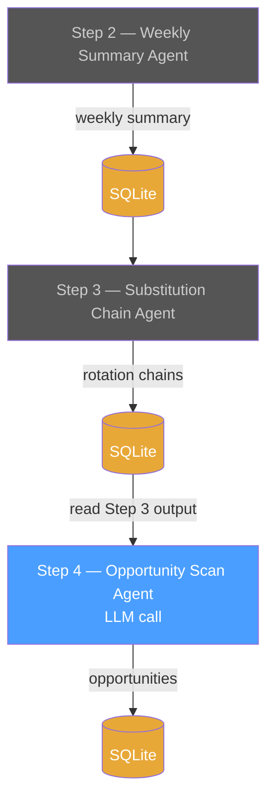

# Step 4 — Opportunity Scan Agent

**Role:** Rotation Target Scanner

Reads Step 3's substitution chains and rotation signals from the database, and flags the strongest capital rotation destinations worth watching. Distills Step 3's analysis into a ranked shortlist of actionable targets.

---

## Pipeline Position



Every step follows the same pattern: **DB → text → LLM → response → DB.** No cross-LLM calls between steps. The database is the only interface.

---

## Trigger

**Chained:** Runs immediately after Step 3 completes successfully.

**Precondition:** A `SubstitutionChainRuns` row with Status = Completed exists for the current week.

---

## Input

| Source | Table | What |
| --- | --- | --- |
| DB | `SubstitutionChainRuns` | Latest completed substitution chain analysis (RawMarkdownOutput) |
| DB | `RotationChains` | Structured rotation entries (CapitalFleeing, FlowsToward, Mechanism) |

The application queries the latest `SubstitutionChainRun` and formats its content as text for the LLM prompt. See [Example Input](#example-input) below.

---

## Agent Prompt

```text
You are a rotation target scanner. You will receive a substitution chain analysis showing where capital is rotating — which sectors capital is fleeing, where it is flowing, and the mechanism driving the rotation.

Your job is to identify up to 3 categories or themes that are capturing the strongest capital inflows based on the rotation signals.

For each target, provide:
- **Category or theme:** What is it?
- **Signal strength:** Strong / Moderate (based on how many rotation chains point to it)
- **Why it's interesting:** One sentence connecting the rotation signal to potential opportunity.
- **Risk caveat:** One sentence on why this might NOT work or what could reverse the signal.

Rules:
- Only flag categories where capital is clearly flowing TO (the "flows toward" column in the substitution table).
- Rank by signal convergence — categories where multiple rotation chains converge rank higher.
- Do not search the web. Work only with the provided substitution analysis.
- Be specific — "defence ETFs benefit from stagflation sector rotation" is better than "consider defence."
- Maximum 3 targets. If nothing stands out, say so — do not force weak signals.
- Today's date is {current_date}.
```

---

## Example Input

The input is **read from the DB** — Step 3's saved substitution chain analysis:

```text
SUBSTITUTION CHAIN ANALYSIS — Week of March 12--18, 2026

Rotation chains:
- Energy supply shock → Oil/LNG exporters win → GCC sovereign wealth expands → MENA equities re-rated upward.
- Inflation fear → Real asset premium rises → Gold as monetary hedge + inflation hedge.
- Infrastructure as inflation pass-through → CPI-linked contracts reprice upward.
- AI capex immune sub-sector → hyperscaler capex decoupling from macro downturn.

Substitution table:

| Capital fleeing | Flows toward | Mechanism |
| --- | --- | --- |
| US growth equities | Real assets (gold, infra) | Duration compression, real yield proxy |
| Energy-importing EM (Korea, Asia, Japan) | Energy-exporting EM (MENA, GCC) | Terms-of-trade inversion |
| Long-duration bonds | Short-duration / T-bills | Rate hold → yield curve steepens at long end |
| Consumer discretionary | Energy, defence, commodities | Stagflation sector rotation |
```

---

## Example Output

```text
ROTATION TARGETS — Week of March 12--18, 2026

---

1. **Defence / Aerospace ETFs — Strong signal**
   Three rotation chains converge here: stagflation sector rotation away from consumer discretionary, geopolitical escalation (Iran war) driving defence spending, and energy-exporting sovereigns (GCC) increasing military procurement.
   *Risk:* Ceasefire or de-escalation would reverse the geopolitical premium overnight.

2. **Short-duration / T-bill funds — Strong signal**
   Rate hold at 3.5--3.75% with zero cut probability through June makes cash-like instruments attractive. Capital fleeing long-duration bonds flows here. Yield curve steepening adds relative value vs long end.
   *Risk:* A dovish Fed surprise or sudden growth scare could trigger a duration rally, making long bonds outperform.

3. **Energy producers (upstream oil & gas) — Moderate signal**
   Single rotation chain: Brent above $100 with Hormuz disruption is a direct tailwind for upstream producers. Strong mechanism but only one chain pointing here.
   *Risk:* IEA reserve releases or demand destruction at $100+ oil could cap upside. Energy is notoriously mean-reverting.
```

---

## Output

### LLM Response Schema

| Section | Required | Description |
| --- | --- | --- |
| Rotation targets (max 3) | Yes | Each with category, signal strength, rationale, and risk caveat |
| Signal strength | Yes | Strong (multiple chains converge) / Moderate (single chain) |
| Risk caveat | Yes | One sentence on what could reverse the signal |

### Persistence

| Purpose | Table | Key Columns | Notes |
| --- | --- | --- | --- |
| Save raw LLM response | `OpportunityScanRuns` | RunId, SubstitutionChainRunId (FK), Timestamp, ModelId, Status, Duration, InputTokens, OutputTokens, TotalTokens, **RawMarkdownOutput** | One row per run. Raw markdown stored for audit/replay. |
| Save structured data | `RotationTargets` | TargetId, RunId (FK), Category, SignalStrength (Strong/Moderate), Rationale, RiskCaveat | One row per target (max 3). Parsed from the raw markdown output. |

This agent does **not** search the web. It reads Step 3's saved output from the database — no dependency on Step 1 or Step 2.

This is the final pipeline step — `RotationTargets` rows are consumed by the final report generator, not another LLM agent.

---

## Downstream Consumers

- **Final report** — All step outputs are combined into a weekly markdown report for the user.

### Trend Analysis

All pipeline runs are persisted with timestamps. Querying `RotationTargets` across multiple weeks enables trend detection:

- **Persistent targets** — "Defence ETFs flagged as Strong for 3 consecutive weeks" → high-conviction signal
- **Fading targets** — "Energy producers dropped from Strong to Moderate to absent" → rotation exhausting
- **Emerging targets** — "Short-duration funds appeared this week for the first time" → new rotation starting

This cross-run data is the foundation for future portfolio integration — matching persistent rotation trends against a fixed fund category taxonomy and using RAG to find specific buyable funds by description and name.
