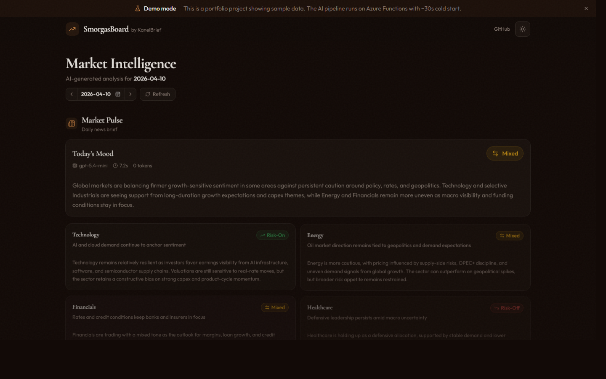
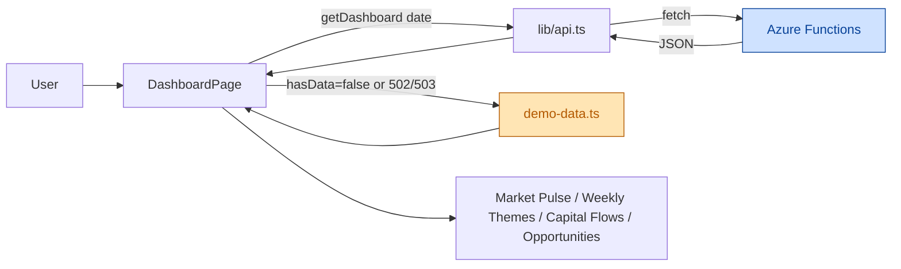

# Frontend — KanelBrief

> Next.js 16 dashboard that visualises the daily market-intelligence pipeline. Talks to the .NET Azure Functions backend in [../backend/](../backend/).

## 🎬 Preview



> Live demo: [lemon-bush-08a967d03.4.azurestaticapps.net](https://lemon-bush-08a967d03.4.azurestaticapps.net/)

## 📋 Overview

Single-page dashboard that renders the four agent outputs produced by the backend pipeline:

- **Market Pulse** — latest news brief with sentiment & confidence.
- **Weekly Themes** — rolling weekly summary.
- **Capital Flows** — substitution-chain analysis.
- **Opportunities** — opportunity-scan results.

Falls back to baked-in demo data when the backend is cold or unavailable, so the site always renders something.

## 🛠️ Tech Stack

| Technology             | Version | Purpose                      |
| ---------------------- | ------- | ---------------------------- |
| Next.js                | 16.2    | React framework (App Router) |
| React                  | 19.2    | UI                           |
| TypeScript             | 5.x     | Type safety                  |
| Tailwind CSS           | 4.x     | Styling                      |
| shadcn + Base UI       | latest  | Component primitives         |
| next-themes            | 0.4     | Dark/light mode              |
| lucide-react           | 1.7     | Icons                        |
| Jest + Testing Library | latest  | Unit tests                   |

## 🏗️ Data Flow



A 5-second timer triggers the cold-start banner while Azure F1 spins up.

## 🚀 Quick Start

```bash
npm install
npm run dev          # http://localhost:3000
```

Make sure the backend Functions host is running on `http://localhost:7071`, or set `NEXT_PUBLIC_API_URL` (see below). If neither is reachable, the dashboard renders demo data.

## 📜 Available Scripts

| Script            | Description                       |
| ----------------- | --------------------------------- |
| `npm run dev`     | Start Next.js dev server          |
| `npm run build`   | Production build (static export)  |
| `npm start`       | Run production build              |
| `npm run lint`    | ESLint                            |
| `npm test`        | Jest unit tests                   |
| `npm run test:ci` | Jest with coverage                |

## 📁 Project Structure

```text
frontend/
├── app/                      # App Router entry (layout, page, globals)
├── components/
│   ├── dashboard/            # Market pulse, weekly themes, capital flows, opportunities
│   ├── ui/                   # shadcn primitives (button, card, badge, ...)
│   ├── header.tsx footer.tsx
│   ├── demo-banner.tsx cold-start-banner.tsx
│   └── theme-provider.tsx theme-toggle.tsx
├── lib/
│   ├── api.ts                # Typed backend client
│   ├── demo-data.ts          # Fallback payload
│   ├── types.ts              # DashboardData + run types
│   └── utils.ts
├── __tests__/                # Jest tests mirroring app/ structure
├── public/                   # Static assets
├── staticwebapp.config.json  # Azure Static Web Apps routing/headers
└── next.config.ts
```

## 🔐 Environment Variables

| Variable              | Purpose          | Default                 |
| --------------------- | ---------------- | ----------------------- |
| `NEXT_PUBLIC_API_URL` | Backend base URL | `http://localhost:7071` |

Create `.env.local` (git-ignored) to override. In production this points at the Azure Functions host.

## 🔌 Backend API

The client in [lib/api.ts](lib/api.ts) calls:

| Method | Path                             | Used by                    |
| ------ | -------------------------------- | -------------------------- |
| GET    | `/api/dashboard?date=YYYY-MM-DD` | Dashboard page (aggregate) |
| GET    | `/api/runs/news-briefs`          | News brief history         |
| GET    | `/api/runs/weekly-summaries`     | Weekly summary history     |
| GET    | `/api/runs/substitution-chains`  | Substitution chain history |
| GET    | `/api/runs/opportunity-scans`    | Opportunity scan history   |

See [../backend/README.md](../backend/README.md) for full endpoint details.

## 🧪 Testing

```bash
npm test                 # run once
npm test -- --watch      # watch mode
```

Tests live in [`__tests__/`](__tests__) and mirror the `app/` structure. Hydration-safe date handling (see [app/page.tsx](app/page.tsx)) is covered there.

## ☁️ Deployment

Deployed as a static export to **Azure Static Web Apps** (free tier). Routing and headers live in
[staticwebapp.config.json](staticwebapp.config.json). The built artefacts land in `out/` via `npm run build`.

## 📚 Related

- [../README.md](../README.md) — project overview
- [../backend/README.md](../backend/README.md) — API & architecture
